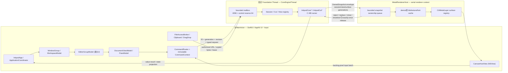
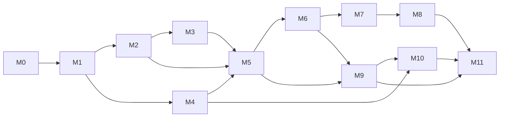

# inkpod macOS ネイティブ GUI 移植計画

## 1. 結論と推奨ターゲットアーキテクチャ

最低 deployment target を `macOS 26.0`（Tahoe）とし、次の構成を推奨する。

- UI は SwiftUI を第一選択とする。
- Scene は `DocumentGroup` ではなく、`WindowGroup(for: WorkspaceID.self)` と独自 `SessionCoordinator` を使う。
- AppKit は Canvas、低レベル入力、file panel、pasteboard、drag/drop、window lifecycle、アクセシビリティ補助だけに限定する。
- 主 Canvas は `NSViewRepresentable` で埋め込む、`CAMetalLayer` backing の専用 `NSView` と Metal renderer とする。
- SwiftUI `Canvas`、Core Graphics/Core Animation、`MTKView` は補助用途に限定する。
- UI/Input、Core、Renderer を三つの実行領域に分離する。
- `InkpodCore` の create／全操作／destroy は一つの長寿命 `Foundation.Thread` に固定する。Swift actor や serial `DispatchQueue` はこの thread owner の代替にしない。
- Rust Core、`.inkpod` v26、replay epoch 23、canonical procedure semantics は変更しない。
- 既存 ABI v14 で移植を開始する。ただし `SHORT-001` 完了には Windows VK/Ctrl 固有の shortcut record を置換する ABI v15 が必要で、M3 の独立変更として扱う。
- CMake を公式 umbrella entry として維持し、checked-in Xcode project を CMake から呼ぶ macOS sub-build とする。
- Release は arm64／x86_64 Universal 2 を既定とする。Intel Tahoe 実機 runner がなければ x86_64 runtime は未検証と明記する。
- App Sandbox を既定とし、Developer ID 署名、Hardened Runtime、notarization を最初の配布経路とする。

SwiftUI の `DocumentGroup` はファイルの open/save lifecycle を SwiftUI が所有するため、同一 Cell session の複数 view、Cut と Cell の別 owner、Core savepoint、atomic save、独自 close/shutdown を表現しにくい。[DocumentGroup](https://developer.apple.com/documentation/SwiftUI/DocumentGroup) に対し、`WindowGroup` は window ごとの state と標準 Window command を提供するので、独自 coordinator と組み合わせる。[WindowGroup](https://developer.apple.com/documentation/SwiftUI/WindowGroup)

### Owner の対応

| Windows上の意味   | macOS owner                               | 所有するもの                                                                                                                      |
| ----------------- | ----------------------------------------- | --------------------------------------------------------------------------------------------------------------------------------- |
| `ApplicationHost` | `@MainActor ApplicationCoordinator`       | workspace/session registry、Core/Renderer host、settings、file broker、clipboard、job registry。active document pointerは持たない |
| `WorkspaceWindow` | `WorkspaceModel`                          | 一つの `WindowGroup` scene、最大2 EditorGroup、pane/layout、focus history、CutSession                                             |
| `CutSession`      | `CutSessionModel` + Core-thread slot      | Cut file identity、revision、history、dirty、savepoint、member identity                                                           |
| `DocumentSession` | `DocumentSessionModel` + Core-thread slot | Cell file identity、recovery、共有Core handleへの値ID                                                                             |
| `DocumentView`    | `DocumentViewModel`                       | view ID、zoom、pan、flip、guide、表示frameなどのprojection                                                                        |
| `EditorGroup`     | `EditorGroupModel`                        | tab/view placement、focus history、可視Canvas surface 1個                                                                         |
| `CoreHost`        | `CoreEngineThread`                        | 固定thread上のCore registry、bounded mailbox、task/cancellation                                                                   |
| `RendererHost`    | `MetalRendererHost`                       | 一つのrenderer execution context、surface registry、device別cache、resource budget                                                |
| Dock pane         | scoped pane model                         | Application／Follow／Pinned／Job targetとgeneration                                                                               |

この分離は既存の意味上の owner と一致する。[SPEC.md:58–95](/Users/shuichi/GitHub/inkpod/SPEC.md:58)、[AGENTS.md:26](/Users/shuichi/GitHub/inkpod/AGENTS.md:26)

### 計画上のdirectory構成

必要になったマイルストーンでだけ追加し、空directoryを先行生成しない。

```text
apps/macos/
  Inkpod.xcodeproj
  Config/
  App/
  Application/
  Workspace/
  Sessions/
  Commands/
  CoreBridge/
    C/include/
    Swift/
  Renderer/
  UI/
    Panes/
    Dialogs/
  Platform/
    FileAccess/
    Clipboard/
    DragDrop/
  Resources/
    Assets.xcassets
    Localizable.xcstrings
    Info.plist
    Inkpod.entitlements
  Tests/
    Unit/
    Integration/
    UITests/
cmake/macos/
tests/macos/
```

## 2. 調査した現在状態

### リポジトリ上の事実

| 現在状態                                                                                        | 根拠                                                                                                                                                                                                                                                    | macOS計画への意味                                          |
| ----------------------------------------------------------------------------------------------- | ------------------------------------------------------------------------------------------------------------------------------------------------------------------------------------------------------------------------------------------------------- | ---------------------------------------------------------- |
| `SPEC.md` が利用者向け意味と要件IDの正本                                                        | [AGENTS.md:5–11](/Users/shuichi/GitHub/inkpod/AGENTS.md:5)                                                                                                                                                                                              | Mac固有UIの都合でCore semanticsを変えない                  |
| 現在のfrontendは C++/Win32、CanvasはD3D11/D2D/DXGI                                              | [SPEC.md:9–16](/Users/shuichi/GitHub/inkpod/SPEC.md:9)                                                                                                                                                                                                  | C++ frontendを再利用せず、意味上のownerとrouteだけ写像する |
| CMakeが唯一のbuild入口                                                                          | [AGENTS.md:19](/Users/shuichi/GitHub/inkpod/AGENTS.md:19)、[SPEC.md:14](/Users/shuichi/GitHub/inkpod/SPEC.md:14)                                                                                                                                        | Xcodeを並列のroot builderにしない                          |
| Rust CoreはOS非依存、`inkpod-ffi`だけがstaticlib                                                | [Cargo.toml:1](/Users/shuichi/GitHub/inkpod/Cargo.toml:1)、[rust/inkpod-ffi/Cargo.toml:8](/Users/shuichi/GitHub/inkpod/rust/inkpod-ffi/Cargo.toml:8)                                                                                                    | 4 crateと意味処理をそのまま再利用できる                    |
| ABIは純C・current version 14                                                                    | [core_ffi.h:4–69](/Users/shuichi/GitHub/inkpod/include/inkpod/core_ffi.h:4)、[docs/ffi.md:54](/Users/shuichi/GitHub/inkpod/docs/ffi.md:54)                                                                                                              | Clang moduleからSwiftへimport可能                          |
| Coreはcreate threadと同じOS threadで全操作/destroyが必要                                        | [core_ffi.h:3242](/Users/shuichi/GitHub/inkpod/include/inkpod/core_ffi.h:3242)                                                                                                                                                                          | dedicated `Thread` が必須                                  |
| snapshotはimmutableでCoreから独立し、renderer threadでrelease可能                               | [core_ffi.h:6007](/Users/shuichi/GitHub/inkpod/include/inkpod/core_ffi.h:6007)、[core_ffi.h:6176](/Users/shuichi/GitHub/inkpod/include/inkpod/core_ffi.h:6176)                                                                                          | Metal queueへownership transferできる                      |
| native形式はv26／epoch 23のみ                                                                   | [docs/file-format.md:1–11](/Users/shuichi/GitHub/inkpod/docs/file-format.md:1)、[docs/determinism.md:3](/Users/shuichi/GitHub/inkpod/docs/determinism.md:3)                                                                                             | GUI移植ではversionを上げない                               |
| 保存はsame-directory temporary→flush→replace、成功後だけsavepoint更新                           | [docs/file-format.md:1270](/Users/shuichi/GitHub/inkpod/docs/file-format.md:1270)                                                                                                                                                                       | Sandbox下でもこのatomicityを維持する必要がある             |
| Windows owner/thread/snapshot設計は既に分離済み                                                 | [docs/architecture.md:334](/Users/shuichi/GitHub/inkpod/docs/architecture.md:334)、[docs/architecture.md:479](/Users/shuichi/GitHub/inkpod/docs/architecture.md:479)、[docs/architecture.md:505](/Users/shuichi/GitHub/inkpod/docs/architecture.md:505) | Mac側の設計雛形として利用できる                            |
| `apps/macos`、Xcode project、Swift/module mapは存在しない                                       | 読み取り専用tree確認                                                                                                                                                                                                                                    | macOS frontend基盤は未着手                                 |
| `PORT-001` はCore portabilityをVerifiedとしているが、Sandbox frontendのfile-authority gapが残る | [docs/compatibility.md:31](/Users/shuichi/GitHub/inkpod/docs/compatibility.md:31)                                                                                                                                                                       | M4に明示的なfile access decision gateが必要                |

### Command inventory の正確な基準

現在のsourceを基準にすると、数は次のように分かれる。

| 集合                                             |  数 |
| ------------------------------------------------ | --: |
| `resource.h` に存在する生の `IDM_*` symbol       | 387 |
| dynamic history range marker 2個を除くstatic候補 | 385 |
| production static command ID                     | 384 |
| 1言語あたりのmenu/control occurrence             | 391 |

production外は、履歴可視化rangeのfirst/last marker 2個と、予約aggregate `IDM_BATCH_OPERATION_ADD` 1個である。[resource.h:49](/Users/shuichi/GitHub/inkpod/apps/windows/app/resource.h:49)、[resource.h:120](/Users/shuichi/GitHub/inkpod/apps/windows/app/resource.h:120)、[resource.h:392](/Users/shuichi/GitHub/inkpod/apps/windows/app/resource.h:392)

391 occurrence は、384 unique command、Filter/Toolに重複する Dust 1件、Layer paneの代替control 6件で構成される。[app_ui_ja.generated.rc:51](/Users/shuichi/GitHub/inkpod/apps/windows/app/app_ui_ja.generated.rc:51)、[app_ui_ja.generated.rc:296](/Users/shuichi/GitHub/inkpod/apps/windows/app/app_ui_ja.generated.rc:296)、[app_ui_ja.generated.rc:877](/Users/shuichi/GitHub/inkpod/apps/windows/app/app_ui_ja.generated.rc:877)

[docs/windows-command-inventory.md:9](/Users/shuichi/GitHub/inkpod/docs/windows-command-inventory.md:9) はこの区別を概ね記録している。一方、[docs/primitive-route-inventory.md:174](/Users/shuichi/GitHub/inkpod/docs/primitive-route-inventory.md:174) の「381 Windows commands」は古いproseで、同文書のmachine-readable節とsource-derived testは384を扱っている。[route_inventory.rs:368](/Users/shuichi/GitHub/inkpod/rust/inkpod-core/tests/route_inventory.rs:368)

macOS parityの分母は384とし、391を再現対象のUI数にしない。

### ローカルtoolchain

読み取り専用確認の結果:

- macOS 26.6.1、arm64
- Xcode 26.6、build 17F113
- macOS SDK 26.5
- Swift 6.3.3、target `arm64-apple-macosx26.0`
- rustc 1.95.0
- CMake 4.4.2
- installed Rust targetは `aarch64-apple-darwin` のみ。`x86_64-apple-darwin` は未導入
- build/testは今回実行していない

### 再利用する部分

- Rust 4 crateと全domain logic
- C ABIのopaque Core/view/task/snapshot
- native save/open、common image codecs、preview、batch、Cut、sequence route
- immutable render snapshotとrevision/generation contract
- Windows側のowner model、bounded queue、stale rejection、shutdown test scenario
- command/state/shortcut catalogの意味情報
- 既存Rust unit/property/golden/ABI test
- ja-JP/en-USの意味上の文言。ただしWin32 resource形式は再利用しない

### 置換する部分

- `HWND`、Win32 message loop、COM、Common Controls
- D3D11/D2D/DXGI/WIC/DirectWrite renderer
- RC menu/dialog/resource、HKCU layout/shortcut record
- MSIX/portable ZIP packaging
- Windows DPI、UI Automation、shell integration

### 現在不足している基盤

- macOS product target、XCTest/XCUITest target
- C headerのClang moduleとSwift安全wrapper
- dedicated Core owner threadのSwift実装
- Metal rendererとCanvas input adapter
- macOS command/parity manifest
- String Catalog、asset catalog、UTType、entitlements
- App Sandbox file-authority broker
- macOS smoke、accessibility、performance、sign/notarize pipeline

## 3. macOS向け設計原則

### 3.1 Stateとownerを混同しない

- SwiftUI／Observation modelは表示用projectionとstable IDだけを持つ。
- Core document state、history、dirty、savepointはRustが唯一のauthority。
- view logical stateもCoreのview APIをauthorityとし、Swift側はrevision付きprojectionを保持する。
- `OpaquePointer`、C struct、borrowed span、mutable Core stateをSwiftUI Viewへ渡さない。
- `FocusedSceneValue` には可変model pointerではなく、workspace/session/view/pane/job IDとgenerationからなるimmutable `CommandContext` を渡す。
- queryとexecutionは同じcontextを使い、stale時に現在activeな別documentへ再解決しない。[SwiftUI FocusedValue](https://developer.apple.com/documentation/SwiftUI/Focus)

### 3.2 Threadモデル

Appleの通常actorは共有thread poolで実行されるため、actor isolationはOS thread identityを保証しない。[Actor](https://developer.apple.com/documentation/Swift/Actor) 固定Core ownerには専用 [`Thread`](https://developer.apple.com/documentation/Foundation/Thread) を使う。

- `@MainActor`: SwiftUI/AppKit、input event、command context、window/pane state
- `CoreEngineThread`: Core registryと全Core ABI call
- `MetalRendererHost`: Metal device/queue/cache/surface、snapshot borrow/release
- Swift actor: async façade、continuation、job stateだけ。C ABIは呼ばない

初期queue contractは既存Windows値に合わせる。

- 通常work capacity: 4096
- stroke control reserve: 64
- accepted sample上限: 1,048,576
- begin/end/cancelは破棄しない
- append coalesceは同じcaptured route内だけ
- enqueue/allocation failureはreserve laneからstroke全体をcancelし、部分commitを防ぐ

### 3.3 C ABI import

推奨方式は、private Clang module `InkpodCoreC` とSwift wrapper `InkpodCoreBridge`。

```text
module.modulemap
  → InkpodCoreC.h
      → #include <inkpod/core_ffi.h>
          → libinkpod_ffi.a
```

- 正本headerを複製しない。
- bridging headerをapp target全体へ公開しない。
- raw C moduleをimportできるのはBridge targetだけ。
- `struct_size`、feature flags、UTF-8、status、TLS diagnostic、releaseをBridgeで集約する。
- Core handleはCore threadのregistryから外へ出さない。
- snapshotだけを一回移動可能な `OwnedSnapshot` に包む。
- snapshotのborrowed pixel/spanを長寿命 `Data(bytesNoCopy:)` にしない。

SwiftによるC pointer importの性質はAppleの[Using imported C functions in Swift](https://developer.apple.com/documentation/swift/using-imported-c-functions-in-swift)に従う。

### 3.4 Canvas方式の比較と決定

| 候補                                                     | 長所                                                                                      | 不足                                                                                                        | 判定                            |
| -------------------------------------------------------- | ----------------------------------------------------------------------------------------- | ----------------------------------------------------------------------------------------------------------- | ------------------------------- |
| SwiftUI `Canvas`                                         | 宣言的UI内の軽量2D描画                                                                    | 内部要素のinteraction/accessibilityを持たず、tile cache・tablet・snapshot ownership・GPU budgetの制御が弱い | thumbnail/chart/補助overlayのみ |
| Core Graphics + Core Animation                           | native 2D、text、静的overlay                                                              | 大画像のdirty tile uploadとprocess-wide renderer queueを明示制御しにくい                                    | 印刷・補助描画のみ              |
| `NSViewRepresentable` + `MTKView`                        | drawable管理が容易、迅速な導入                                                            | MTKView単位のdelegate lifecycleが既存process-wide renderer/surface registryと重なりやすい                   | spike/diagnosticのみ            |
| `NSViewRepresentable` + custom `NSView` + `CAMetalLayer` | input、backing pixel、surface lifecycle、renderer thread、ownership queueを完全に制御可能 | drawable、resize、display linkを自分で管理する必要                                                          | **採用**                        |

SwiftUI `Canvas` の制限はAppleの[Canvas](https://developer.apple.com/documentation/SwiftUI/Canvas)、SwiftUI/AppKit境界は[NSViewRepresentable](https://developer.apple.com/documentation/SwiftUI/NSViewRepresentable)を根拠とする。Apple自身も、追加制御が必要な場合に `NSView` と `CAMetalLayer` を使い、background renderingできる構成を示している。[Creating a custom Metal view](https://developer.apple.com/documentation/metal/creating-a-custom-metal-view)

Metal契約:

- 一つの可視EditorGroupにつき一つのCanvas surface
- inactive tabはsurfaceを持たず、active切替時にrebind
- snapshot tile ID/revisionをtexture cache keyにする
- dirty tileだけupload
- pan/zoomは既存textureを再利用
- 同じsurfaceの未描画snapshotだけlatest-wins置換
- hidden/occluded/minimized時はsnapshot buildとPresentを止める
- memory pressureでは非表示view、thumbnail、Light Table、reference、GPU cacheの順に回収
- device/display変更ではGPU resourceだけ再生成し、Core document/view stateを保持
- drawable取得はrender直前、保持時間を最小化する
- CanvasはSDR sRGBを初期契約とし、document/exportのRGBA8/16データをSwiftで量子化しない

### 3.5 Retinaと座標

```text
NSEvent/AppKit point
  → CanvasHostView.convertToBacking
  → client device pixel
  → Core view/device→document transform
```

- `CAMetalLayer.drawableSize` はbacking pixel。
- scale factorはAppKit point→device pixelで一度だけ適用する。
- Coreの `device = document * zoom + pan` へscaleを再適用しない。
- display移動はdrawable/cache revisionだけを変え、document/view logical revisionを変えない。

Appleは単純なscale乗算ではなくviewのbacking変換APIを推奨している。[High Resolution Guidelines](https://developer.apple.com/library/archive/documentation/GraphicsAnimation/Conceptual/HighResolutionOSX/APIs/APIs.html)

### 3.6 Input

`CanvasHostView` が次を `NSEvent` から固定幅の既存input batchへ正規化する。

- mouse down/drag/up
- precise scroll、magnify
- tablet point/proximity
- pressure、tilt、rotation、buttons
- modifier transition
- temporary pan
- temporary eyedropper
- begin/append/end/cancel

`NSEvent` はtablet pressure/tilt等を提供する。[NSEvent](https://developer.apple.com/documentation/AppKit/NSEvent)

Shortcut routerはfirst responderがtext editor／`NSTextInputClient`、またはmarked text activeなら文字shortcutとmulti-strokeを停止する。[NSTextInputClient](https://developer.apple.com/documentation/AppKit/NSTextInputClient)

### 3.7 macOS向け情報設計

- App menu: About、Settings、Acknowledgements、Services、Hide、Quit
- File: New Cell／Cut、Open、Open Recent、Close View、Save、Save As、Revert、Recovery、Import、Export
- Edit: Undo/Redo、Cut/Copy/Paste/Delete、floating-selection操作
- View: zoom/pan/flip、guide/grid、sidebar/inspector、EditorGroup、fullscreen
- Cell: Cell、paper/frame、Layer/Plane、annotation
- Selection: 全selection command
- Image: WindowsのFilter/Effect/Adjustmentを意味上の一群へ統合
- Tools: raster/vector/tool mode
- Color: Color/Palette/Chart
- Animation: WindowsのProductionをCut/Sequence/Light Table/Subpalette/Motionとして改称
- Window: workspace window、pane、named workspace、window navigation
- Help: Help、shortcut一覧、diagnostic、web

macOSではmenu barが全commandの到達可能性を担い、toolbarは頻用actionへの重複surfaceとする。[HIG: Menus](https://developer.apple.com/design/human-interface-guidelines/menus)、[HIG: Toolbars](https://developer.apple.com/design/human-interface-guidelines/toolbars)

標準shortcutはCommand中心とし、Command-Q/W/S/O/Zなどを転用しない。[HIG: Keyboards](https://developer.apple.com/design/human-interface-guidelines/keyboards)

Paneの写像:

- Tool: leading sidebar
- Tool Options: contextual inspector／toolbar group
- Color／Palette／Chart: trailing inspector tabs
- Layer／Plane: trailing inspector
- Locator: inspector tabまたはtoolbar popover
- Sequence: collapsible bottom timeline
- Light Table／Subpalette／Reference: inspector tabs
- Batch: workspaceに紐づく専用 `WindowGroup`
- Job Progress: toolbar `ProgressView`＋詳細sheet/window
- status: Canvas下の非glass status region

Windowsの自由dockを再現せず、sidebar／inspector／bottom timeline／utility windowの組合せに制約する。named workspaceはvisibility、width、選択tab、EditorGroup方向/比率を保存する。

### 3.8 Liquid Glass

標準toolbar、sidebar、inspector、sheet、popover、menuを使い、Tahoeのsystem appearanceに任せる。標準componentはLiquid Glassを自動採用し、custom effectは最上位の操作surfaceへ限定する。[HIG: Materials](https://developer.apple.com/design/human-interface-guidelines/materials)、[Build a SwiftUI app with the new design](https://developer.apple.com/videos/play/wwdc2025/323/)

追加してよい場所:

- 一時的なpan/zoom HUD
- Canvas上の少数のfloating control
- 明確なprimary action

追加しない場所:

- Metal Canvas
- document pixel、checker background
- palette swatch、chart、color judgement領域
- layer thumbnail、sequence thumbnail
- list/tree content
- status/dirty/coordinate text
- screenshot/export

`Reduce Transparency`、`Increase Contrast`、`Reduce Motion`でsystem materialが変化するため、Liquid Glassのピクセル値をgolden契約にしない。

### 3.9 Build構成の比較

| 案                                       | 評価                                                                                         |
| ---------------------------------------- | -------------------------------------------------------------------------------------------- |
| CMake Xcode generatorで全Swift appを生成 | 現在のsingle-config制約と衝突し、asset/string catalog、scheme、signing、XCUITestの管理が弱い |
| SPMをroot builderにする                  | app bundle、signing、UI test、Rust orchestrationが弱く、CMake唯一入口に違反                  |
| Xcode Run Scriptから直接Cargoを呼ぶ      | Xcodeが第二のbuild rootになり、CMake/Cargo dependencyが二重化                                |
| **CMake→Cargo→xcodebuild**               | **採用**。CMakeはumbrella、Xcode projectはnative macOS sub-buildの正本                       |

推奨フロー:

```text
CMake/Ninja
  → Cargo arm64 / x86_64 staticlib
  → lipo Universal libinkpod_ffi.a
  → generated xcconfig
  → xcodebuild project/scheme/test/archive
```

SPMは将来のpure Swift moduleまたは外部依存だけに限定し、初期Rust linkerには使わない。

## 4. Windows→macOS機能parity matrix

| Windows側の機能領域・概念                      | `SPEC.md`契約                                                   | macOS surface                                     | API                                                                       | macOS向け変更理由                                           | owner／data flow                                    |    M | 検証                                                          |
| ---------------------------------------------- | --------------------------------------------------------------- | ------------------------------------------------- | ------------------------------------------------------------------------- | ----------------------------------------------------------- | --------------------------------------------------- | ---: | ------------------------------------------------------------- |
| Application、Help/About、language              | `SHORT-001`、新規`MAC-SHELL-001`案                              | App menu、Settings、Help                          | SwiftUI `Commands`、`Settings`、AppKit About panel、String Catalog        | WIN-001を流用せずMac固有契約を分離                          | ApplicationCoordinator→CommandRouter／ResourceStore | 3,11 | ja/en、長文、user string非翻訳、Help route、a11y              |
| New/Open/Save/Recent/Revert/Recovery           | `IO-001/002`,`SESSION-001`,`CELL-001`,`CUT-001`                 | 標準File menu、panel、sheet                       | `NSOpenPanel`,`NSSavePanel`,`NSDocumentController`,`NSFileCoordinator`    | `DocumentGroup`へownershipを渡さない                        | FileAccessBroker→Core thread→save/open result       |    4 | success/cancel/failure、savepoint、reopen、duplicate identity |
| Window/session/view lifecycle                  | `SESSION-001`,`VIEW-004/005`,`WORKSPACE-002`                    | WindowGroup、document tabs、Close View/Window     | SwiftUI scenes、FocusedValue、AppKit window delegate                      | Cmd-Wの対象を明示し、view/document/window closeを混同しない | issue-time CommandContext→session registry          |  1–5 | same-session multi-view、dirty prompt一回、stale close        |
| Workspace／EditorGroup／pane                   | `WORKSPACE-001/002`,`WIN-002`の意味部分                         | sidebar、inspector、bottom timeline、Batch window | `NavigationSplitView`, `.inspector`, `HSplitView/VSplitView`, WindowGroup | Win32 dockを模写せず最大2 groupとscopeを維持                | WorkspaceModel→EditorGroup/PaneModel                |    5 | layout round-trip、monitor recovery、focus、follow/pin        |
| Canvas/view/input                              | `RENDER-001`,`VIEW-001..005`,`SNAP-001`,`PERF-001`              | Metal Canvas                                      | NSViewRepresentable、NSView、CAMetalLayer、Metal、NSEvent                 | Retina/input/cache/thread性能のため                         | MainActor input→Core queue→snapshot→Renderer        |    2 | coordinates、pressure/tilt、hidden draw=0、device recovery    |
| Command/state/shortcut                         | `SHORT-001`,`WORKSPACE-002`                                     | menu、toolbar、context menu、chord router         | SwiftUI Commands、FocusedValue、NSEvent monitor                           | Command中心、text/IME guard、標準shortcut優先               | descriptor→pure state owner→issue-time router       |    3 | 384 disposition、one owner/state/surface、prefix-free         |
| Cell／Layer／Plane                             | `DOC-001/002/003`,`CELL-001`                                    | New Cell sheet、Layer/Plane inspector             | SwiftUI Form/List/OutlineGroup、sheet                                     | Common Controls配置を捨てnative inspectorへ                 | typed dialog result→Core primitive→projection       |    5 | all layer kinds、no-op/invalid/cancel、save/reopen            |
| Raster paint／fill／tool options               | `PAINT-001..004`,`FILL-001..003`,`COLOR-REPLACE-001`            | Tool sidebar、contextual options、Canvas          | SwiftUI controls＋AppKit input＋Core ABI                                  | algorithmはCoreのみ                                         | tool state→input batch→canonical primitive          |    6 | stroke unit、overflow atomicity、main-line protection、Undo   |
| Color／Palette／Chart／Locator                 | `COLOR-001/002`,`COLOR-CHART-PREVIEW-001`,`COLOR-OUTPUT-QA-001` | trailing inspector、popover                       | ColorPicker、Grid/List、Metal/SwiftUI preview                             | glassを色判定領域に適用しない                               | pane target→Core query/asset API                    |    6 | RGBA8/16、preview cancel、target pin/stale                    |
| Selection／clipboard／transform                | `SEL-001..004`,`CLIP-001`,`XFORM-001..003`                      | Selection menu、Canvas handles、sheets            | NSPasteboard、UTType、Canvas overlay                                      | private typed＋standard imageを同時提供                     | pasteboard adapter→Rust payload→transaction         |  4,7 | coordinate preservation、paste outside、floating cancel       |
| History／preview                               | `HIST-001/002`,`FILTER-PREVIEW-001`                             | Edit menu、History inspector、sheet preview       | Undo menu integration、List、async update                                 | AppKit UndoManagerをauthorityにしない                       | standard command→Core history route                 |  7,8 | branch、Redo truncation、dynamic rows、latest-wins            |
| Filter／Effect／Adjustment／Vector             | `FILTER-*`,`EFFECT-001`,`ADJUST-001`,`VECTOR-*`,`PAINT-002/003` | Image/Tools menu、sheets、inspector               | SwiftUI sheet/form、Metal overlay                                         | Win menu分類をImage/Toolsへ整理                             | typed values→preview token→one commit               |    8 | nonaccumulative preview、Cancel、stale、raster/vector parity  |
| Annotation／shooting frame／vanishing point    | `ANNOTATION-001`,`SHOOTING-FRAME-001`,`VANISHING-POINT-001`     | Cell menu、inspector、Canvas overlay              | SwiftUI form/list、Metal/CoreText                                         | OS font解決だけfrontend、意味はCore                         | inspector→Core request→snapshot overlay             |    8 | text/point/frame bounds、export、save/reopen                  |
| Cut／Sequence／Light Table／Subpalette／Motion | `CUT-001`,`SEQ-*`,`LT-*`,`COLOR-002`                            | Animation menu、bottom timeline、inspector tabs   | SwiftUI timeline/list、Metal thumbnails                                   | WindowsのProductionを意味の明確なAnimationへ改称            | CutSession／pane target→Core task/snapshot          |    9 | endpoint、membership Undo、pin/stale、motion cancel           |
| Batch／long jobs                               | `BATCH-001..004`,`SAFE-001`,`PERF-001`                          | dedicated Batch window、job progress              | WindowGroup、ProgressView、security-scoped folder panel                   | 複雑な長時間workflowをinspectorへ押し込まない               | immutable graph→task→job token→report               |   10 | dry-run、partial failure禁止、cancel、folder scope            |
| Import/export／drag/drop                       | `IO-002`,`CLIP-001`,`BATCH-*`                                   | Finder drop、pasteboard、Export sheet             | NSDraggingDestination、Transferable/NSPasteboard、UTType                  | OS adapterだけSwift、codecはRust                            | URL/data representation→Core bytes API              | 4,10 | supported形式のみ、unknown拒否、alpha/DPI                     |

### 384 command のreconciliation

M0でmachine-readable `macos-command-parity.json` を作る。各Windows production IDに以下を一つだけ割り当てる。

- `macEquivalent`
- `macStandardIntegrated`
- `mergedIntoSemanticCommand`
- `notApplicable`

必須field:

- Windows `IDM_*`
- platform-neutral semantic key
- `SPEC.md` requirement ID
- dispositionと理由
- macOS surface
- route owner/state owner/target scope
- milestone
- test ID

検証規則:

1. ja/en RCのproduction setが一致し384であること。
2. 生387 symbolを `384 production + reserved aggregate 1 + range marker 2` に完全partitionすること。
3. parity manifestがproduction 384とset-equalityで、missing/duplicate/extraがゼロであること。
4. many-to-oneは`mergedIntoSemanticCommand`だけ許可する。
5. `notApplicable`にはSPEC根拠と代替surface有無を必須にする。
6. active semantic commandごとにrouter、state providerが一つずつ存在すること。
7. active commandに到達可能surfaceが一つ以上存在すること。
8. 391 occurrenceをmacOSで再現しない。
9. dynamic history rowsは384とは別inventoryとしてsession/generation/staleを検査する。
10. `SPEC.md`側からの逆向きcoverageも行い、static ID外のgesture、drop、dialog、lifecycleを落とさない。

## 5. Owner／thread／data flow



Raw Core pointerはCORE内だけ、raw snapshot pointerは`OwnedSnapshot`内だけに存在する。

## 6. マイルストーン一覧と依存関係

| ID  | 名称                                       | 主な完了物                                                            |
| --- | ------------------------------------------ | --------------------------------------------------------------------- |
| M0  | Contract・build・ABI import基盤            | CMake→Cargo→Swift ABI smoke、Universal方針、384 parity ledger         |
| M1  | 固定Core threadとsession lifecycle         | Core registry、bounded queue、create/close/shutdown headless vertical |
| M2  | SwiftUI product shellとMetal Canvas        | WindowGroup、実Canvas、default stroke、pan/zoom、snapshot renderer    |
| M3  | Command・menu・shortcut・localization      | Commands、FocusedValue、ABI v15 shortcut、Settings、ja/en             |
| M4  | File lifecycle・Sandbox・clipboard/drop    | Open/Save/Recent/Revert/Recovery、UTType、security scope              |
| M5  | Document/Layer/Plane・multi-view workspace | Cell workflow、Layer/Plane、最大2 group、named workspace              |
| M6  | Paint・Fill・Color                         | Tool/Options、raster tools、fill、Color/Palette/Chart/Locator         |
| M7  | Selection・Transform・History              | selection、floating、transform、Undo/Redo、history visualization      |
| M8  | Filter・Effect・Vector・Annotation         | preview sheets、adjustment、vector、frame/VP/annotation               |
| M9  | Cut・Sequence・Light Table                 | animation workflow、subpalette/reference、motion                      |
| M10 | Batchとlong-running jobs                   | Batch window、folder authority、dry-run/cancel/report                 |
| M11 | Parity freeze・hardening・distribution     | 384 zero-pending、a11y/perf/soak、Universal signed/notarized artifact |



## 7. 各マイルストーンの詳細

### M0 — Contract・build・ABI import基盤

- **完了状態:** CMake入口からarm64 Rust staticlib、Clang module、Swift ABI smokeをbuild/runできる。smokeは専用test thread上でCore create→query→snapshot build/release→destroyを行う。384 command parity manifestがsourceと一致する。
- **要件:** `ARCH-001/002`,`ABI-001/002`,`PORT-001`,`SAFE-001`。先行なし。
- **scope/file:** `apps/macos/Inkpod.xcodeproj`、`Config/*.xcconfig`、`CoreBridge/C/include/{InkpodCoreC.h,module.modulemap}`、最小Swift bridge、`cmake/macos/*`、macOS CMake preset、`tests/macos/command-parity.json`と検証script。
- **data flow:** Swift smoke→Clang module→ABI v14→Rust staticlib。Universal releaseはarm64/x86_64 thin `.a`を別target-dirで構築して`lipo`する。
- **状態:** success、ABI mismatch、short struct、NULL、wrong-thread、unknown status、double release、link failure。
- **test:** C11/C++20 include/layout、Swift import/link、opaque pointer NULL化、TLS diagnostic同thread copy、snapshot cross-thread release、raw387の完全partition。
- **検証:** V-Rust、V-MacUnit、V-Universal-build。Xcode 26/Tahoe SDK。x86 target/runnerがなければruntime未検証。
- **完了判定:** CMake以外をrootにせず全smokeが通り、manifestの分母が384、unclassified raw symbolがゼロ。
- **risk/mitigation:** anonymous C unionのSwift importはcompile testで判定し、必要時だけprivate inline helperを置く。header複製はしない。
- **後続:** product UI、Core registry、renderer、file accessは作らない。

### M1 — 固定Core threadとsession lifecycle

- **完了状態:** headless integration executableが複数Core sessionを一つの固定OS thread上で作成・操作・破棄し、queue saturationやshutdown raceを再現可能に検証する。
- **要件:** `SESSION-001`,`WORKSPACE-002`,`CELL-001`,`ABI-001`,`SAFE-001`。依存M0。
- **scope/file:** `CoreBridge/Swift/CoreOwnerThread.swift`、`CoreHost.swift`、`CoreRequest/Result.swift`、session/cut/view stable ID型、bounded mailbox、task wrapper、integration tests。
- **data flow:** actor/MainActorは値requestをenqueueするだけ。Core pointerはthread-local registry。completionはvalue projectionとして返す。
- **状態:** success、no-op、invalid generation、cancel、stale、queue-full、allocation failure、close中input、active stroke、shutdown。
- **test:** pthread identity、64 sessions、4096 saturation、control reserve、continuation exactly-once、create failure rollback、active transient cancel、destroy順。
- **検証:** V-Rust＋V-MacUnit＋Thread Sanitizer extended run。
- **完了判定:** createからdestroyまで同じthread ID、Core pointerのSendable/MainActor/global保存なし、leak/hangなし。
- **risk/mitigation:** `deinit`でCoreを直接destroyせず、明示close protocolからowner threadへenqueueする。
- **後続:** UI、Canvas、file panelは未追加。

### M2 — SwiftUI product shellとMetal Canvas

- **完了状態:** product appが`WindowGroup`で起動し、実Core CellをMetal Canvasへ表示する。mouse/tabletでdefault pencil stroke、pan/zoom、cancel、Undoが動く。
- **要件:** `RENDER-001`,`VIEW-001..005`,`SNAP-001`,`PAINT-001`,`HIST-001`,`PERF-001`,`WIN-002`のplatform-neutral意味。依存M1。
- **scope/file:** `App/InkpodApp.swift`、Application/Workspace owner、`Renderer/{CanvasHostView,MetalRendererHost,SurfaceRegistry,TileCache}.swift`、`.metal` shader、AppKit event adapter。
- **data flow:** backing-pixel input→Core queue→snapshot envelope→renderer ownership queue→CAMetalLayer。
- **状態:** success、view-state no-op、invalid coordinate、stroke cancel、stale snapshot、surface closed、drawable nil、device/display change、memory pressure。
- **test:** coordinate round-trip、last pixel/half-open bounds、pressure/tilt fallback、begin/end非破棄、latest-wins、hidden tab draw=0、resize/occlusion/backing scale、snapshot release全path。
- **検証:** V-MacUnit＋V-MacUI＋V-Metal。Retina実機、tabletは利用可能機器でmanual evidenceも残す。
- **完了判定:** UI/Core/Metalの実縦切り、document rasterがdevice loss後も保持され、pan/zoomで全tile再uploadしない。
- **risk/mitigation:** custom layerの複雑性はprocess-wide surface registryとApple custom Metal viewパターンで局所化する。
- **後続:** 全tool、pane、file operationsはまだsurface化しない。

### M3 — Command・menu・shortcut・localization

- **完了状態:** 実装済みsemantic commandが標準menu、toolbar、context menuから同じrouter/stateへ到達し、ja/en、Settings、shortcut編集、IME guardが動く。
- **要件:** `SHORT-001`,`WORKSPACE-002`,`HIST-001`、新規`MAC-SHELL-001`案。依存M2。
- **scope/file:** Commands descriptor/router/state provider、`Localizable.xcstrings`、Settings scene、Help/About/Acknowledgements、shortcut editor。
- **ABI v15:** `InkpodShortcutStrokeV2`を追加し、platform-neutral key kind（Unicode scalar／named key）、`PRIMARY/SHIFT/ALTERNATE/CONTROL` modifierを定義する。PRIMARYはWindows Ctrl、macOS Commandへmapし、物理Controlを区別する。header/docs/tests/Windows adapterを同時更新する。native file/replay versionは変更しない。
- **data flow:** SwiftUI `Commands`／NSEvent→normalized sequence→pure resolver→issue-time `CommandContext`→owner route。
- **状態:** success、state no-op、invalid/conflicting sequence、Cancel、stale context、timeout、IME marked text、persistence failure。
- **test:** 1–4 stroke、prefix-free、conflict replacement、reset、standard shortcut非上書き、text/IME guard、menu enabled/checked、one-owner/state/surface。
- **検証:** V-Rust＋V-MacUnit＋V-MacUI＋Windows CIの既存debug/release presets。
- **完了判定:** ABI v15 driftなし、Windows regressionなし、UI未実装commandのplaceholder surfaceなし。
- **risk/mitigation:** ABI riskをshortcut変更だけに限定し、M3内でもCore/FFI test→Windows adapter→Mac UIの順で縦切りする。
- **後続:** parity manifestの未実装行は残せるが、UIには出さない。

### M4 — File lifecycle・Sandbox・clipboard/drop

- **完了状態:** New/Open/Open Recent/Save/Save As/Revert/autosave/recovery、common image import/export、Finder drop、typed clipboardが実ファイルで動く。
- **要件:** `IO-001/002`,`SESSION-001`,`CLIP-001`,`CUT-001`,`SAFE-001`,`PORT-001`。依存M1、product UIはM2。
- **scope/file:** `FileAccessBroker`、security-scope lease/bookmark store、NSOpen/SavePanel adapter、NSFileCoordinator adapter、UTType/Info.plist、NSPasteboard/drag destination。
- **data flow:** authorized URL/bytesはfrontendが所有し、Coreへborrowed UTF-8 pathまたはcopied bytesだけ渡す。bookmark/NSURLはCore/journalへ入れない。
- **状態:** success、same-target no-op、invalid type、panel Cancel、stale bookmark/revision、permission denial、write/flush/replace failure、duplicate file identity。
- **ABI decision gate:** まずABI v15のpath APIをactive security scope＋`NSFileCoordinator`下で検証する。same-directory atomic replace、Cut member、autosave、Batch folderで成立しないことが実証された場合だけABI v16としてnative staged decode/prepare-save/commit-saveまたはbounded file-authority APIを追加する。header/docs/testを同時更新し、v26/epoch23は維持する。
- **test:** savepoint only-after-replace、Save As conflict、cancel/failure atomicity、reopen、private+standard pasteboard representation、unsupported format rejection、bookmark stale regeneration。
- **検証:** V-Rust＋V-MacUnit＋V-MacUI。Sandbox-enabled Tahoe実行が必須。
- **完了判定:** path authorityをCoreへ永続化せず、既存file bytes/checksumとWindows reopen結果が一致する。
- **risk/mitigation:** security scopeはlease型でstart/stopをbalanceし、background job完了まで保持する。[App Sandbox file access](https://developer.apple.com/documentation/security/accessing-files-from-the-macos-app-sandbox)
- **後続:** Batchの複数folder workflowはM10。

### M5 — Document/Layer/Plane・multi-view workspace

- **完了状態:** New Cellの全条件、Cell properties、Layer/Plane tree、同じsessionの複数view、最大2 EditorGroup、window間view移動、named workspaceが動く。
- **要件:** `DOC-001/002/003`,`CELL-001`,`VIEW-004/005`,`WORKSPACE-001/002`,`SESSION-001`。依存M2–M4。
- **scope/file:** New Cell/Properties sheet、LayerPlane inspector、EditorGroup split/tab、pane target model、workspace record/presets。
- **data flow:** sheetはtyped initial/resultだけ。all-or-none Cell plan→Core thread→成功後だけsession/view/tabを公開。
- **状態:** success、no-op property update、invalid/overflow、Cancel、stale pane/session、allocation/publication failure、layout corruption。
- **test:** layer/plane type rules、main/color plane switching、three-cell all-or-none、same-session view revision分離、duplicate view、cross-window move/copy、layout round-trip/monitor clamp。
- **検証:** V-Rust＋V-MacUnit＋V-MacUI。複数displayもmanual/automated coverage。
- **完了判定:** document stateをviewごとに複製せず、二分割が再帰しない。pane follow/pin targetがstale時に安全に無効化される。
- **risk/mitigation:** SwiftUI List性能が不足した場合だけLayer/Plane listをAppKit collection/outline viewへ置換する。判断はprofile evidenceに基づく。
- **後続:** 未実装paneの空tabは作らない。

### M6 — Paint・Fill・Color

- **完了状態:** Tool/Tool Options、全raster paint/fill/color replacement、Color/Palette/Chart、LocatorがCanvasからCoreまで接続される。
- **要件:** `PAINT-001..004`,`FILL-001..003`,`COLOR-REPLACE-001`,`COLOR-001/002`,`COLOR-CHART-PREVIEW-001`,`COLOR-OUTPUT-QA-001`。依存M5。
- **scope/file:** Tool sidebar、contextual options、Color inspector、Palette/Chart/Locator panes、original tool symbol assets。
- **data flow:** control値→typed request／asset ID→Core transaction→snapshot tile update。
- **状態:** success、no-op stroke/fill、invalid tolerance/color、cancel、stale target、queue overflow、fill visit overflow、asset allocation failure。
- **test:** mouse/pressure stroke、main-line protection、gap close、selection boundary、RGBA8/16、palette replacement、chart preview Cancel、Locator follow/pin。
- **検証:** V-Rust＋V-MacUnit＋V-MacUI＋V-Metal＋quick benchmark。
- **完了判定:** algorithmをSwiftへ再実装せず、Undo一単位、失敗時revision/history/dirty/ID不変。
- **risk/mitigation:** color judgement領域はnon-glass、sRGB SDRで固定し、system accentをdocument colorへ混入させない。
- **後続:** vector toolとadvanced effectsはM8。

### M7 — Selection・Transform・History

- **完了状態:** selection作成/演算、floating selection、clipboard paste positioning、mirror/rotate/scale/placement、Undo/Redo、branch history visualizationが動く。
- **要件:** `SEL-001..004`,`CLIP-001`,`XFORM-001..003`,`HIST-001/002`。依存M6。
- **scope/file:** Selection menu、Canvas handles、Transform sheet、History inspector、dynamic history menu adapter。
- **data flow:** issue-time bounds/pivot/revision→preview token→latest preview→OK一commit／Cancel復元。
- **状態:** success、empty/no-op、invalid bounds/pivot、Cancel、stale preview、allocation/clipboard failure。
- **test:** selection algebra、half-open bounds、five-anchor transform、paste outside Canvas、preview nonaccumulation、Undo/Redo round-trip、branch/stale dynamic row。
- **検証:** V-Rust＋V-MacUnit＋V-MacUI＋V-Metal。
- **完了判定:** standard Cmd-Z/Shift-Cmd-ZがCore historyを唯一のauthorityとして操作し、UndoManagerに別履歴を作らない。
- **risk/mitigation:** custom Canvas handleにはmenu/keyboard/accessibility actionを必ず併設する。
- **後続:** filter/adjustment previewはM8。

### M8 — Filter・Effect・Vector・Annotation

- **完了状態:** Filter、tone adjustment、effects、adjustment layer、vector edit、annotation、shooting frame、vanishing pointがnative sheet/inspector/Canvasで動く。
- **要件:** `FILTER-001/002`,`FILTER-PREVIEW-001`,`EFFECT-001`,`ADJUST-001`,`VECTOR-001/002`,`ANNOTATION-001`,`SHOOTING-FRAME-001`,`VANISHING-POINT-001`,`PAINT-002/003`。依存M7。
- **scope/file:** Image/Tools commands、parameter sheets、preview coordinator、Vector/Annotation inspector、CoreText/font resource adapter、Metal overlay pipeline。
- **data flow:** typed initial values→bounded preview request→latest-wins result→snapshot overlay／OK commit。
- **状態:** success、parameter no-op、invalid/nonfinite、Cancel、stale revision/target、task failure、renderer resource failure。
- **test:** preview update ordering、Cancel/OK Undo、raster/vector equivalence、annotation text/point bounds、frame/VP save/reopen、instruction export。
- **検証:** V-Rust＋V-MacUnit＋V-MacUI＋V-Metal＋quick benchmark。
- **完了判定:** font解決/GPU resourceだけMac側、geometry/procedure/export semanticsはCore側。
- **risk/mitigation:** preview UIをMainActorで計算せず、Core taskとrenderer snapshotで処理する。
- **後続:** animation workflowはM9。

### M9 — Cut・Sequence・Light Table

- **完了状態:** Cut作成/編集/保存、Sequence、Light Table、Subpalette、Reference、motion playback、endpoint policyが一連のproduction workflowとして動く。
- **要件:** `CUT-001`,`SEQ-001`,`SEQ-ENDPOINT-001`,`SEQ-STRUCT-001`,`SEQ-002`,`LT-001..003`,`COLOR-002`。依存M4–M6。
- **scope/file:** Animation menu、Sequence bottom timeline、LightTable/Subpalette/Reference inspector、Cut sheets、motion controller。
- **data flow:** CutSession target→member IDs/revision→Core transaction/task→thumbnail/snapshot→Metal/UI projection。
- **状態:** success、endpoint stopped no-op、invalid membership/path、Cancel、stale Cut/member/view、missing/orphan member、decode/save/task failure。
- **test:** add/remove/move/renumber Undo、Stop/Wrap、empty/one-cell、natural order、Light Table bulk registration、source UUID preservation、save/reopen/recovery。
- **検証:** V-Rust＋V-MacUnit＋V-MacUI＋V-Metal＋quick benchmark。
- **完了判定:** CutとCellのhistory/savepointを統合せず、relative identityとindividual Cell filesを維持する。
- **risk/mitigation:** motion playbackはCore mutationsと分離し、nonvisible viewでthumbnail/snapshot更新を停止する。
- **後続:** multi-folder batchはM10。

### M10 — Batchとlong-running jobs

- **完了状態:** 全concrete Batch operationを専用windowで構成、preview、dry-run、実行、cancelでき、job reportとoutputが残る。
- **要件:** `BATCH-001..004`,`SAFE-001`,`PERF-001`,`IO-001/002`。依存M4、M6、M9。
- **scope/file:** Batch `WindowGroup`、graph editor、input/output folder broker、job registry、progress/report UI、file promiseが必要な場合のadapter。
- **data flow:** immutable graph＋security-scoped folder leases→Core task→progress/cancel→immutable report→UI。
- **状態:** success、empty/dry-run no-op、invalid graph/duplicate output、Cancel、stale scope/session、permission/save/decode/allocation failure。
- **test:** 全operation ID、natural ordering、dry-run no output、cancel no partial commit、output collision、bookmark expiry、app/window close中job、shutdown race。
- **検証:** V-Rust＋V-MacUnit＋V-MacUI＋full benchmark scenario。
- **完了判定:** 予約aggregateをproduction commandとして数えず、具体operationへ型付きdispatchする。部分結果をlive documentへcommitしない。
- **risk/mitigation:** folder accessはユーザーに明示選択させ、job lifetime中leaseを保持する。
- **後続:** 機能追加のcatch-allをM11へ送らない。

### M11 — Parity freeze・hardening・distribution

- **完了状態:** parity manifestのpending/unmappedがゼロ。Tahoe appがaccessibility、appearance、fault injection、performance、Universal build、署名/notarizationを通過する。
- **要件:** 全共有要件、`SAFE-001`,`PERF-001`,`PORT-001`、新規Mac shell/render/io/a11y/pkg要件案。依存M8–M10。
- **scope/file:** smoke/fault/soak/UI test、sign/archive scripts、release checklist、documentation/status/compatibility更新。
- **data flow:** 新機能は追加しない。各ownerのmetricsとparity evidenceを集約する。
- **状態:** 全milestoneのsuccess/no-op/invalid/cancel/stale/failureに加え、sleep/wake、memory pressure、GPU/display switch、sign/notary failure。
- **test:** queue saturation、close中input、active stroke、stale snapshot、save failure、shutdown race、repeated window/tab/layout、VoiceOver、keyboard、IME、appearance、Retina/multidisplay、clean-machine launch。
- **検証:** 全verification profile、Universal archive、codesign/spctl/notary/stapler。Windows/Linux/Rust regressionを含む。
- **完了判定:** 384 command全行が許可されたdispositionに分類され、active semantic commandのroute/state/surface/testが完全。未接続UI、常時成功stub、未検証をVerified扱いする項目がゼロ。
- **risk/mitigation:** Tahoe runnerやIntel hardware不足は隠さず、該当項目をExperimental/未検証のままrelease gateで判断する。
- **後続:** なし。欠落機能はM11で雑に実装せず、所有milestoneを再度開く。

## 8. テスト、CI、性能、アクセシビリティ、配布戦略

### Verification profile

計画上追加するpreset名であり、今回は作成・実行していない。

**V-Rust**

```text
cargo fmt --check
cargo clippy --workspace --all-targets --all-features -- -D warnings
cargo test --workspace --all-features
cargo bench --package inkpod-core --bench core_workflows -- --quick
RUSTDOCFLAGS="-D warnings" cargo doc --package inkpod-core --all-features --no-deps
```

**V-MacUnit**

```text
cmake --preset macos-arm64-debug
cmake --build --preset macos-arm64-debug --target inkpod_macos_check
ctest --preset macos-arm64-debug --output-on-failure
```

CMake target内部で `xcodebuild test` を実行する。直接の `xcodebuild` は診断用途だけにする。

**V-MacUI**

```text
cmake --build --preset macos-arm64-debug --target inkpod_macos_ui_test
```

**V-Metal**

- Metal API validation/capture
- Retina/multiple display
- resize/occlusion/sleep-wake
- device/display switch
- memory-pressure injection
- Instruments Metal/System Trace

**V-Universal**

```text
cmake --preset macos-universal-release
cmake --build --preset macos-universal-release --target inkpod_macos_archive
lipo -archs <app-executable>
lipo -archs <libinkpod_ffi.a>
file <app-executable>
```

**V-Windows regression**

```text
cmake --preset windows-x64-debug
cmake --build --preset windows-x64-debug
ctest --preset windows-x64-debug

cmake --preset windows-x64-release
cmake --build --preset windows-x64-release
ctest --preset windows-x64-release
```

Windows ARM presetsもCIで維持する。

### CI matrix

| Job                     | 内容                                                                 |
| ----------------------- | -------------------------------------------------------------------- |
| Rust portable           | Linux/macOS、全crate、fmt/clippy/test/doc/quick benchmark            |
| Windows                 | 既存x64/ARM configure/build/test/smoke/package                       |
| macOS arm64             | Tahoe＋Xcode 26、Swift 6 strict concurrency、unit/integration/UI     |
| macOS x86_64            | Tahoe Intel runnerがあればruntime。なければcross-build/linkのみ      |
| macOS Universal release | 両slice、archive、resource/entitlement/UTType検査                    |
| Signed release          | protected runner、Developer ID、notary credential、clean Tahoe smoke |

Tahoe runnerがない場合、次は明示的に未検証とする。

- Liquid Glass実表示
- XCUITest accessibility audit
- VoiceOver/IME
- Metal/Retina/multiple display
- sleep/wake
- notarized artifact launch

### Performance

既存 `PERF-001` のcanonical workload、revision-max、意味counter、approved envelopeを変更しない。[SPEC.md:585](/Users/shuichi/GitHub/inkpod/SPEC.md:585)

追加するsignpost/counter:

- command enqueue→Core dispatch
- Core execution
- snapshot build
- queue depth/max wait
- accepted/coalesced sample
- replaced/rejected snapshot
- dirty/upload bytes
- tile cache hit/rebuild/eviction
- drawable acquire、encode、present
- hidden view draw count
- SwiftUI body update
- file read/save/replace
- security-scope lease lifetime

`OSSignposter`とInstrumentsを使う。[Recording Performance Data](https://developer.apple.com/documentation/os/recording-performance-data)

### Accessibility

- SwiftUI標準controlを優先する。
- custom Canvasはdocument name、tool、zoom、selection、available actionsをaccessibility treeへ公開する。
- pixel/vector primitiveを一つずつVoiceOver nodeにしない。
- Layer/Plane/Sequence等のsemantic rowを個別elementにする。
- 全pointer actionにmenu/keyboard/accessibility actionを設ける。
- focus order、default focus、rotor、menu enabled/checked stateを検証する。
- `accessibilityIdentifier`はtest用であり、利用者向けlabelの代用にしない。
- `performAccessibilityAudit`をXCUITestに組み込み、VoiceOver manual runも保持する。[Performing accessibility audits](https://developer.apple.com/documentation/accessibility/performing-accessibility-audits-for-your-app)
- Full Keyboard Access、Reduce Transparency、Increase Contrast、Reduce Motion、Dark/Light、accent colorをmatrix化する。
- Liquid Glassのpixel matchingは行わない。

### Localizationとasset

- `Localizable.xcstrings` をja/enの正本とする。[String Catalog](https://developer.apple.com/documentation/xcode/localizing-and-varying-text-with-a-string-catalog)
- user-owned document/layer/plane/path文字列を翻訳しない。
- standard actionはSF Symbols。
- inkpod固有toolは新規original vector symbol＋accessible label。
- 旧製品やWindows iconを転用しない。[HIG: SF Symbols](https://developer.apple.com/design/human-interface-guidelines/sf-symbols)

### Sandboxと配布

- entitlementはApp Sandbox、user-selected read/write、必要なbookmark scopeだけ。
- network、automation、library-validation exception等は必要性を証明するまで付けない。
- Developer ID Application署名
- Hardened Runtime
- secure timestamp
- `get-task-allow`なし
- `notarytool submit --wait`
- notary log確認
- ticket staple/validate
- notarized DMGまたはZIP
- clean Tahoe machineでlaunch/open/save/reopen

AppleはDeveloper ID配布のnotarizationにHardened Runtime等を要求する。[Notarizing macOS software before distribution](https://developer.apple.com/documentation/security/notarizing-macos-software-before-distribution)

## 9. 将来の文書更新案

今回は編集しない。

### `AGENTS.md`

追加・明確化する内容:

- SwiftUI／AppKit／Metalの責務
- macOSのMainActor／Core fixed thread／Renderer context
- CMakeはumbrella entry、Xcode projectはmacOS sub-buildの正本
- `apps/macos` directory責務
- Mac resource、sandbox、signing、notarization
- Universal 2とminimum deployment
- Windows static CRT規則がWindows限定であること
- frontend共通のno-global-active-pointer／snapshot ownership

### `SPEC.md`

既存 domain IDはプラットフォーム共通として再利用する。`WIN-001/002`と`PKG-001`はMacの完了証拠に流用しない。

追加を推奨するID:

- `MAC-ARCH-001`: CMake→Cargo staticlib→Xcode sub-build、SwiftUI owner分離、固定Core thread
- `MAC-SHELL-001`: Tahoe native menu/window/Help/About/Settings/Liquid Glass
- `MAC-RENDER-001`: Metal、Retina、pointer/tablet、occlusion/device recovery
- `MAC-IO-001`: App Sandbox、security scope、UTType、file panel、pasteboard/drop
- `MAC-A11Y-001`: VoiceOver、Full Keyboard Access、IME、appearance/accessibility settings
- `MAC-PKG-001`: Universal 2、Developer ID、Hardened Runtime、notarization

Windows固有IDとは別にMac IDを追加する必要がある。追加しない場合、Mac shellを`WIN-001`でVerifiedにする不自然な状態になる。

### その他

- `docs/architecture.md`: macOS owner/thread/render/build章。古い381 command proseもsource-derived値へ修正
- `docs/ffi.md`: Swift import、OwnedSnapshot、Core thread、ABI v15 shortcut
- `docs/compatibility.md`: Mac requirement行とevidence
- `docs/implementation-status.md`: 各milestoneの現状と未検証事項
- `docs/macos-command-inventory.md`: generated parity summary
- `docs/macos-release-checklist.md`: signing/notary/clean-machine手順
- `docs/file-format.md`: format変更なし。ABI file-authority追加時も保存bytesが同一ならversionは上げない
- `docs/determinism.md`: GUI移植だけでは変更しない

## 10. Critical pathと並列化可能範囲

Critical path:

```text
M0 build/ABI
→ M1 Core owner thread
→ M2 Metal product vertical
→ M3 command/shortcut ABI
→ M5 document/workspace
→ M6 paint/color
→ M7 selection/history
→ M8/M9
→ M10
→ M11 release
```

並列化可能:

- M1後、M4のSandbox/file-authority spikeはM2/M3と並行可能
- M2後、Metal hardeningとM3 command workは別担当で並行可能
- M5後、M8のfilter/vector系とM9のanimation系は並行可能
- accessibility label/testは各機能milestone内で同時実装し、M11へ一括先送りしない
- signing/notary automationはM4のentitlement確定後、feature workと並行可能
- Windows regressionとRust portable CIは全milestoneで常時実行する

## 11. Risk register

| Risk                                               | 重要度 | Mitigation / gate                                                             |
| -------------------------------------------------- | ------ | ----------------------------------------------------------------------------- |
| Swift actorをCore ownerにしてwrong-threadになる    | High   | Foundation Thread固定、pthread ID smoke、raw pointer非Sendable                |
| snapshot use-after-free／double release            | High   | `OwnedSnapshot` one-shot state、reject/replace/shutdown全path test            |
| Sandboxでsame-directory atomic replaceが成立しない | High   | M4実機gate。失敗時だけABI v16 staged file-authority                           |
| ABI v15 shortcutがWindowsを壊す                    | High   | additive change、header/export/layout test、Windows全preset同時検証           |
| command数を381/391と誤認する                       | High   | source-derived384 manifest、raw387 partition、prose drift修正                 |
| Core semanticsをSwiftで再実装する                  | High   | route inventory、document/history route owner structural test                 |
| Liquid GlassがCanvas/color判断を損なう             | High   | Canvas/content領域non-glass、system controlsのみ                              |
| RendererでRGBA16やalphaを量子化する                | High   | tile format別texture、premultiplicationをshader境界に限定、exportはCore       |
| file leaseをjob途中で解放する                      | High   | RAII lease、task completionまで保持、balance test                             |
| close/shutdown中のinput/task race                  | High   | accept停止→transient cancel→Core drain→renderer drain→Core destroy            |
| SwiftUIのlarge tree/timeline性能不足               | Medium | Instruments evidence後だけAppKit list/collectionへ置換                        |
| multiple GPU/display切替                           | Medium | device registry ID別cache、surface generation、GPU resourceだけ再構築         |
| Intel Tahoe runner不在                             | Medium | Universal cross-buildは実施、runtimeを未検証表示。必要ならarm64-only decision |
| VoiceOverでcustom Canvasが未知viewになる           | High   | semantic role/value/actions、menu/keyboard代替、audit＋manual test            |
| CMake↔Xcodeの再帰build                             | Medium | 一方向CMake→xcodebuild。Xcode canonical Cargo script禁止                      |
| localization drift                                 | Medium | String Catalog key parity、user string separation、ja/en UI smoke             |
| release credential不足                             | Medium | unsigned archiveとsigned releaseを別job、Verified判定を分ける                 |

## 12. 未決事項とdecision gate

| 論点                         | 推奨default                                     | 代替                                  | 影響                                                  | 期限                      |
| ---------------------------- | ----------------------------------------------- | ------------------------------------- | ----------------------------------------------------- | ------------------------- |
| CPU配布                      | Universal 2 arm64+x86_64                        | arm64-only                            | size/CI対coverage。Intel runtime runner不足時は未検証 | M0、最終M11               |
| Native fileとSandbox         | 現行path ABI＋security scope＋NSFileCoordinator | ABI v16 staged bytes/file authority   | ABI追加量、Cut/Batch access、atomicity                | M4前半                    |
| App Sandbox                  | Developer ID版でも有効                          | Hardened Runtimeのみ                  | batch/folder usability対security/将来App Store        | M4                        |
| Document scene               | WindowGroup＋独自coordinator                    | DocumentGroup spike                   | save/session ownershipが大きく変わる                  | M1。defaultを覆すならM2前 |
| Canvas                       | custom NSView＋CAMetalLayer                     | MTKView                               | renderer ownership/thread/surface制御                 | M0 spike、M2開始前        |
| Shortcut ABI                 | ABI v15 neutral V2                              | Macだけ独自resolver                   | Core input interpretationの重複、Windows VK混入       | M3                        |
| Pane detachment              | sidebar/inspector＋Batch専用window              | 多数のUtilityWindow                   | target/focus/keyboard複雑性                           | M5                        |
| Workspace persistence        | versioned Codable property-list record          | Application Support DB                | lightweight state対拡張性                             | M5                        |
| x86_64 Verified条件          | Intel Tahoe実行を要求                           | Rosetta/cross-buildのみでExperimental | 配布表示とsupport範囲                                 | M11                       |
| 配布channel                  | notarized Developer ID DMG/ZIP                  | Mac App Store                         | Sandbox/bookmark審査と配布運用                        | M11                       |
| HDR/wide color               | 初期はSDR sRGB                                  | extended-range drawable               | color QAとrenderer complexity                         | M2。必要性は別SPEC変更    |
| Xcode direct developer build | CMake configure/build後にprojectを開く          | XcodeがCargoを直接呼ぶ                | build正本の二重化                                     | M0                        |

## 13. Apple公式資料

- [Xcode 26 Release Notes](https://developer.apple.com/documentation/Xcode-Release-Notes/xcode-26-release-notes)
- [Designing for macOS](https://developer.apple.com/design/human-interface-guidelines/designing-for-macos/)
- [Materials / Liquid Glass](https://developer.apple.com/design/human-interface-guidelines/materials)
- [Meet Liquid Glass — WWDC25](https://developer.apple.com/videos/play/wwdc2025/219/)
- [Build a SwiftUI app with the new design — WWDC25](https://developer.apple.com/videos/play/wwdc2025/323/)
- [Build an AppKit app with the new design — WWDC25](https://developer.apple.com/videos/play/wwdc2025/310/)
- [WindowGroup](https://developer.apple.com/documentation/SwiftUI/WindowGroup)
- [DocumentGroup](https://developer.apple.com/documentation/SwiftUI/DocumentGroup)
- [Building and customizing the menu bar with SwiftUI](https://developer.apple.com/documentation/SwiftUI/Building-and-customizing-the-menu-bar-with-SwiftUI)
- [HIG: Menus](https://developer.apple.com/design/human-interface-guidelines/menus)
- [HIG: Toolbars](https://developer.apple.com/design/human-interface-guidelines/toolbars)
- [HIG: Keyboards](https://developer.apple.com/design/human-interface-guidelines/keyboards)
- [SwiftUI Canvas](https://developer.apple.com/documentation/SwiftUI/Canvas)
- [NSViewRepresentable](https://developer.apple.com/documentation/SwiftUI/NSViewRepresentable)
- [Creating a custom Metal view](https://developer.apple.com/documentation/metal/creating-a-custom-metal-view)
- [MTKView](https://developer.apple.com/documentation/MetalKit/MTKView)
- [NSEvent](https://developer.apple.com/documentation/AppKit/NSEvent)
- [High Resolution Guidelines](https://developer.apple.com/library/archive/documentation/GraphicsAnimation/Conceptual/HighResolutionOSX/APIs/APIs.html)
- [Actor](https://developer.apple.com/documentation/Swift/Actor)
- [Thread](https://developer.apple.com/documentation/Foundation/Thread)
- [Adopting Swift 6 strict concurrency](https://developer.apple.com/documentation/swift/adoptingswift6)
- [Accessibility HIG](https://developer.apple.com/design/human-interface-guidelines/accessibility/)
- [Accessibility fundamentals](https://developer.apple.com/documentation/SwiftUI/Accessibility-fundamentals)
- [Performing accessibility audits](https://developer.apple.com/documentation/accessibility/performing-accessibility-audits-for-your-app)
- [String Catalog](https://developer.apple.com/documentation/xcode/localizing-and-varying-text-with-a-string-catalog)
- [SF Symbols HIG](https://developer.apple.com/design/human-interface-guidelines/sf-symbols)
- [Defining file and data types](https://developer.apple.com/documentation/uniformtypeidentifiers/defining-file-and-data-types-for-your-app)
- [NSPasteboard](https://developer.apple.com/documentation/AppKit/NSPasteboard)
- [Accessing files from the macOS App Sandbox](https://developer.apple.com/documentation/security/accessing-files-from-the-macos-app-sandbox)
- [NSFileCoordinator](https://developer.apple.com/documentation/Foundation/NSFileCoordinator)
- [Building a universal macOS binary](https://developer.apple.com/documentation/Apple-Silicon/building-a-universal-macos-binary)
- [Recording performance data](https://developer.apple.com/documentation/os/recording-performance-data)
- [Notarizing macOS software](https://developer.apple.com/documentation/security/notarizing-macos-software-before-distribution)
- [Developer ID](https://developer.apple.com/developer-id/)

## 実装セッション用プロンプトテンプレート

```text
あなたはmacOSネイティブアプリ、Swift/SwiftUI、AppKit、Metal、Rust C ABIに精通した実装担当者です。

このリポジトリの `MACOS.md` にある 最初の未完了のマイルストーンだけを、同文書の完了条件まで実装してください。後続マイルストーンの機能を先取りしないでください。

開始時に必ず読み取り確認するもの:
1. git status と既存差分
2. AGENTS.md 全文
3. SPEC.md の対象要件IDと関連する利用者向け契約
4. MACOS.md の全体アーキテクチャ、対象マイルストーン、依存マイルストーン
5. docs/architecture.md、docs/ffi.md、docs/compatibility.md、docs/implementation-status.md の関連箇所
6. 対象code/testとmacOS command parity manifest

実装規則:
- Rust CoreをOS非依存のまま維持する
- Swift側へdocument/image/history/selection/format semanticsを再実装しない
- SwiftUI ViewへC ABI pointerやmutable Core stateを露出しない
- MainActor、固定Core owner thread、renderer execution contextを分離する
- process-global active document pointerを作らない
- issue-time ID/generation/revisionでtargetを固定し、stale時に別documentへfallbackしない
- snapshot ownershipをaccept/reject/replace/close/shutdownの全pathでexactly once解放する
- placeholder、未接続button、常時成功stubを追加しない
- 未実装commandはUI surfaceへ出さない
- native `.inkpod` format/replay semanticsは、対象マイルストーンが明示的に要求しない限り変更しない
- Windows版を壊さず、対象外refactor/formatを混ぜない
- Apple API/HIGの判断はApple公式資料で確認する
- commit/push/PRは依頼しない限り行わない

作業順:
1. 対象要件と公開契約を列挙する
2. success/no-op/invalid/cancel/stale/failureの必要なtestを先に固定する
3. 小さな縦切りで実装する
4. MACOS.mdに記載されたverification profileを実行する
5. Windows/Rustの影響範囲に応じたregressionを実行する
6. 現在状態・互換状態・代表検証が変わった場合だけstatus/compatibility文書を更新する
7. command parity manifestの対象行だけをimplementedへ進め、route/state/surface/testの完全性を検証する

完了報告には次を含める:
- 利用者または開発者から観測できる完成状態
- 重要な設計判断
- 変更file
- 対応要件IDとparity行
- 実行した検証と結果
- 実行できなかった検証
- 未検証事項、既知差分、後続マイルストーンへ送った項目
```
