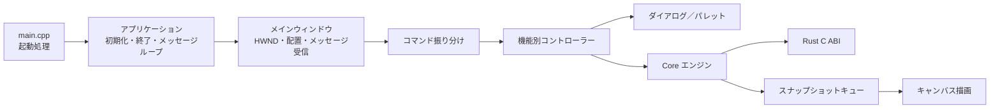

<p align="center">
  
</p>

<h1 align="center">inkpod</h1>

<p align="center">
  GPU アクセラレーションとベクターベースのストロークに対応した、<br>
  アニメーション彩色向けの非破壊ペイントエンジン
</p>

## inkpod について

inkpod は、アニメーション彩色の作業工程を、長期保守しやすい構成で再設計するプロジェクトです。文書状態、画像処理、履歴、保存形式などをプラットフォーム非依存の Rust Core が担い、Windows 11 向けアプリは Win32、Direct3D 11、Direct2D でネイティブに動作します。

主要な制作ワークフローは UI から Core まで実装・検証されています。現在の実装概要、再公開を進めている一部のフローティングパレット、既知の差分については、[実装状況](docs/implementation-status.md)と[互換性一覧](docs/compatibility.md)を参照してください。

## 主な機能

- 2 値、グレースケール、RGBA 8/16 bit のラスターレイヤーと、ベクターレイヤーを扱えます。
- 鉛筆、ブラシ、消しゴム、直線、曲線、図形、折れ線、エアブラシなどの描画ツールを備えています。
- 通常フィル、閉領域フィル、含み塗り、隙間閉じ、塗りあふれ検出など、彩色作業向けの機能を利用できます。
- 矩形、楕円、投げ縄、折れ線、トレース、色指定による選択と、移動、変形、切り取り、コピー、貼り付けに対応しています。
- レイヤー／プレーン管理、ライトテーブル、セルシーケンス、モーションチェックを備えています。
- フィルター、色調整、グラデーション、調整レイヤー、バッチ処理を利用できます。
- 元に戻す／やり直す、プレビューの適用／取消、自動保存と復元に対応しています。
- `.inkpod` v10 形式に加え、PNG、TIFF、TGA、BMP の読み込みと書き出しに対応しています。
- 高 DPI、タブ表示、状態表示、カスタマイズ可能なショートカットに対応しています。

## レイヤーとプレーンの違い

inkpod の文書は、次の階層で構成されます。

```text
セル（1 枚の文書）
└─ レイヤー（重ね合わせの単位）
   └─ プレーン（実際の編集対象）
```

**レイヤー**は、セル画を重ね合わせる大きな単位です。レイヤー単位で順序、表示、編集可否、不透明度などを管理し、2 値彩色、階調彩色、ベクター彩色、汎用ラスター、選択、調整、テキストなど、種類ごとの役割を持ちます。レイヤーの種類によって、内部に置けるプレーンの構成が決まります。

**プレーン**は、レイヤー内で主線、彩色、色トレース、塗り、レタッチなどを分離して保持する最小の編集単位です。ブラシ、塗りつぶし、消しゴム、フィルターなどは、原則として選択中のプレーンを対象にします。プレーンは単なる RGB チャンネルではなく、RGBA 画像、マスク、ベクターパス、塗り領域などを保持できる、役割付きのサブレイヤーです。

代表的な構成は次のとおりです。

| レイヤーの種類 | 主なプレーン |
| --- | --- |
| 2 値彩色 | 2 値主線、彩色、任意のラスター |
| 階調彩色 | グレースケール主線、彩色、任意のラスター |
| ベクター彩色 | ベクター主線、1 つ以上の色トレース線、塗り、任意のラスター |
| 汎用ラスター | 1 つ以上の RGBA ラスター |
| 選択 | 2 値の選択マスク |

たとえば 2 値彩色レイヤーでは、主線プレーンを表示してフィル境界として利用しながら、塗りつぶしやブラシは彩色プレーンだけに書き込めます。これが inkpod の「主線保護」です。

GUI の「レイヤー／プレーン」ペインでは、上段にレイヤー、下段に選択中レイヤーのプレーンを表示します。レイヤーを選ぶとセル全体の重なりのどこを扱うかが決まり、プレーンを選ぶとその中の何を直接編集するかが決まります。レイヤーはレイヤー同士、プレーンは所属レイヤー内のプレーン同士で並べ替えます。必要な主線、彩色、塗りプレーンを最後の 1 つまで削除するなど、レイヤー構造を壊す操作は Core が拒否します。

端的には、レイヤーは「一つの意味を持つ合成単位」、プレーンは「その中で分離された実データと編集対象」です。

## 必要な環境

Windows アプリ全体のビルドには、次の環境が必要です。

- Windows 11
- Visual Studio 2022 または 2026
  - 「C++ によるデスクトップ開発」ワークロード
  - x64 または ARM64 MSVC ツールチェーン
  - Windows SDK
- CMake 3.25 以降
- Ninja
- Rust 1.85 以降の stable MSVC ツールチェーン

インストールした Visual Studio の、ビルド対象と同じアーキテクチャで初期化した **Native Tools Command Prompt** または **Developer PowerShell** を開き、必要なツールを確認します。

```powershell
cl
cmake --version
ninja --version
rustc --version
cargo --version
```

Ninja プリセットは、起動中の開発者シェルに設定されたコンパイラー環境を使用します。プリセット名だけでは MSVC 環境を切り替えません。inkpod は CMake の構成時に、x64／ARM64 のプリセットと実際のコンパイラーターゲットが一致しない場合や、32 bit コンパイラーを検出した場合に停止します。

以前に x86 の開発者シェルからビルドディレクトリを構成した場合は、x64 の開発者シェルを開き、古いコンパイラーキャッシュを更新してください。

```powershell
cmake --fresh --preset windows-x64-release
cmake --build --preset windows-x64-release
```

## Windows アプリのビルドとテスト

CMake がアプリ全体のビルド入口です。CMake から Cargo を呼び出して Rust の `inkpod-ffi` 静的ライブラリをビルドし、MSVC の各ターゲットへリンクするため、先に `cargo build` を実行する必要はありません。Windows の全構成は C/C++ を `/MT`、Rust MSVC target を `+crt-static` とし、最終 EXE に Visual C/C++ runtime を静的リンクします。

x64 のローカル成果物を作る通常の入口は、Debug／Release 共通の build
number を一度だけ増加させるラッパーです。Visual Studio の x64 developer
environment は自動検出されます。次は両構成を clean build し、CTest まで
実行します。

```powershell
powershell.exe -NoProfile -ExecutionPolicy Bypass -File `
  .\scripts\build-windows-x64.ps1 -Clean -Test
```

番号は Git 対象外の `.inkpod-local/build-number.txt` に保持され、失敗した
build の番号も再利用しません。実行内容だけを確認する場合は `-DryRun`、
一方の構成だけを作る場合は `-Configuration Debug` または
`-Configuration Release` を指定します。直接 CMake preset を実行する方法は
引き続き利用できますが、ローカル番号は自動的には増加しません。

リポジトリのルートで、デバッグ版を構成、ビルド、テストします。

```powershell
cmake --preset windows-x64-debug
cmake --build --preset windows-x64-debug
ctest --preset windows-x64-debug
```

デバッグ版のアプリを起動します。

```powershell
.\build\windows-x64-debug\inkpod.exe
```

リリース版では、対応するリリース用プリセットを使用します。

```powershell
cmake --preset windows-x64-release
cmake --build --preset windows-x64-release
ctest --preset windows-x64-release
.\build\windows-x64-release\inkpod.exe
```

ARM64 版では、ARM64 用 MSVC 開発者環境を使用し、Rust ターゲットを一度追加してから `windows-arm-debug` または `windows-arm-release` を指定します。x64 ホストからクロスコンパイルした場合、テストとアプリの実行は ARM64 Windows 環境で行ってください。

```powershell
rustup target add aarch64-pc-windows-msvc
cmake --fresh --preset windows-arm-release
cmake --build --preset windows-arm-release
ctest --preset windows-arm-release
.\build\windows-arm-release\inkpod.exe
```

## Windows 配布物

通常の Windows ビルドは、unsigned MSIX に加えて GitHub Release 向けの
ポータブル ZIP も生成します。Release 成果物は次の場所に作られます。

```text
build/windows-x64-release/package/Inkpod-0.2.2-windows-x64.zip
build/windows-arm-release/package/Inkpod-0.2.2-windows-arm.zip
```

ZIP 名は三つ組の application version、EXE と MSIX は build number を加えた
四つ組 version を使用します。ZIP 直下には次の4ファイルだけを収録します。

```text
Inkpod-0.2.2-windows-x64.zip
├─ inkpod.exe
├─ README.txt
├─ LICENSE.txt
└─ ThirdPartyNotices.txt
```

`inkpod.exe` は別配布の Visual C++ Runtime DLL を必要としませんが、Win32、
Direct2D、Direct3D など Windows 11 の system component は使用します。
ポータブル版は `.inkpod` 関連付けを登録せず、workspace、自動保存、復元などの
状態は通常版と同様に現在の user profile と HKCU へ保存します。

既存の Release build から ZIP だけを明示的に再生成する場合は、対応する target
を指定します。

```powershell
cmake --build --preset windows-x64-release --target inkpod_portable_zip
cmake --build --preset windows-arm-release --target inkpod_portable_zip
```

バージョン更新、両 architecture の clean Release build、パッケージ検証、
GitHub prerelease、ダウンロードリンク更新までの実行内容だけを確認するには
次を使用します。このコマンドは file 更新、build、commit、push、tag、Release
作成を行いません。

```powershell
.\scripts\publish-windows-release.ps1 -Version 0.2.2 -DryRun
```

内容を確認してから `-Publish` で実行します。release branch は clean かつ
`origin/main` と同期済みである必要があります。このコマンドは version bump と
HTML link 更新をそれぞれ commit/push し、`v<version>` tag と GitHub prerelease
を作成するため、通常のローカル build より強い外部変更を行います。

```powershell
.\scripts\publish-windows-release.ps1 -Version 0.2.2 -Publish
```

新規セルは 1920 × 1080 の 2 値彩色セルとして作成されます。UI／入力、単一書き込みの Rust Core エンジン、D3D／D2D 描画は、それぞれ独立したスレッドで動作します。描画中のストロークはペンを離す前からプレビューされ、確定時には 1 回分の「元に戻す」単位として記録されます。

Windows のスモークテストでは、描画、主線保護、履歴、表示状態、保存／破棄／再読み込み、D2D タイルキャッシュ、DPI 変更時の全体表示、デバイス消失からの復旧などを検証します。

## Rust ワークスペースだけを検証する

プラットフォーム非依存の Rust ワークスペースは、対応する stable Rust ツールチェーンがあれば Windows 以外でも検証できます。

```text
cargo fmt --all -- --check
cargo clippy --workspace --all-targets --all-features -- -D warnings
cargo test --workspace --all-features
```

組織のコード整合性ポリシーによって、ローカルでビルドした未署名の Rust FFI テスト実行ファイルがブロックされる環境では、すべてのテストをコンパイルした後、Core のテストを個別に実行します。

```text
cargo test --workspace --all-features --no-run
cargo test --package inkpod-core --all-features
```

## Windows フロントエンドの構成

Windows 側は OS 固有処理を薄いアダプターとして分離し、文書操作や画像処理を Rust Core に集約しています。



## 仕様と開発情報

- 開発時に常時適用する設計境界と品質基準: [開発ガイド](AGENTS.md)
- 維持する機能、挙動契約、要件 ID: [機能・挙動仕様](SPEC.md)
- 現行文書と歴史資料の区分: [ドキュメント一覧](docs/README.md)
- 現在状態、未完了項目、既知差分、代表検証: [実装状況](docs/implementation-status.md)
- 要件ごとの status、代表証拠、既知差分: [互換性一覧](docs/compatibility.md)

## 既知の制限

- 現在のネイティブ保存形式は `.inkpod` v10 です。フォーマットフリーズ宣言までは現在versionだけを受理し、非v10形式のmigration readerは提供しません。
- 未完了の利用者向け項目は、レイヤー／プレーンのmulti-target編集、Light Tableの一括登録・opacity-step、sequence切替設定、および一部accessibility検証です。正確な範囲は[実装状況](docs/implementation-status.md)を参照してください。
