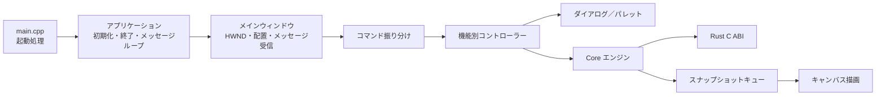

<p align="center">
  
</p>

<h1 align="center">inkpod</h1>

<p align="center">
  GPU アクセラレーションとベクターベースのストロークに対応した、<br>
  アニメーション彩色向けの非破壊ペイントエンジン
</p>

## inkpod について

inkpod は、アニメーション彩色の作業工程を、長期保守しやすい構成で再設計するプロジェクトです。文書状態、画像処理、履歴、保存形式などをプラットフォーム非依存の Rust Core が担い、Windows 11 向けアプリは Win32、Direct3D 11、Direct2D でネイティブに動作します。

M0〜M8 の縦切り実装と検証は完了しています。現在の詳しい実装状況、再公開を進めている一部のフローティングパレット、既知の差分については、[実装状況](docs/implementation-status.md)と[互換性一覧](docs/compatibility.md)を参照してください。

## 主な機能

- 2 値、グレースケール、RGBA 8/16 bit のラスターレイヤーと、ベクターレイヤーを扱えます。
- 鉛筆、ブラシ、消しゴム、直線、曲線、図形、折れ線、エアブラシなどの描画ツールを備えています。
- 通常フィル、閉領域フィル、含み塗り、隙間閉じ、塗りあふれ検出など、彩色作業向けの機能を利用できます。
- 矩形、楕円、投げ縄、折れ線、トレース、色指定による選択と、移動、変形、切り取り、コピー、貼り付けに対応しています。
- レイヤー／プレーン管理、ライトテーブル、セルシーケンス、モーションチェックを備えています。
- フィルター、色調整、グラデーション、調整レイヤー、バッチ処理を利用できます。
- 元に戻す／やり直す、プレビューの適用／取消、自動保存と復元に対応しています。
- `.inkpod` v2 形式に加え、PNG、TIFF、TGA、BMP の読み込みと書き出しに対応しています。
- 高 DPI、タブ表示、状態表示、カスタマイズ可能なショートカットに対応しています。

## 必要な環境

Windows アプリ全体のビルドには、次の環境が必要です。

- Windows 11
- Visual Studio 2022 または 2026
  - 「C++ によるデスクトップ開発」ワークロード
  - x64 MSVC ツールチェーン
  - Windows SDK
- CMake 3.25 以降
- Ninja
- Rust 1.85 以降の stable MSVC ツールチェーン

インストールした Visual Studio の **x64 Native Tools Command Prompt** または **Developer PowerShell** を開き、必要なツールを確認します。

```powershell
cl
cmake --version
ninja --version
rustc --version
cargo --version
```

Ninja プリセットは、起動中の開発者シェルに設定されたコンパイラー環境を使用します。プリセット名に `x64` が含まれていても、x86 の開発者シェルを x64 に切り替えることはできません。inkpod は CMake の構成時に 32 bit コンパイラーを検出すると停止します。

以前に x86 の開発者シェルからビルドディレクトリを構成した場合は、x64 の開発者シェルを開き、古いコンパイラーキャッシュを更新してください。

```powershell
cmake --fresh --preset windows-x64-release
cmake --build --preset windows-x64-release
```

## Windows アプリのビルドとテスト

CMake がアプリ全体のビルド入口です。CMake から Cargo を呼び出して Rust の `inkpod-ffi` 静的ライブラリをビルドし、MSVC の各ターゲットへリンクするため、先に `cargo build` を実行する必要はありません。

リポジトリのルートで、デバッグ版を構成、ビルド、テストします。

```powershell
cmake --preset windows-x64-debug
cmake --build --preset windows-x64-debug
ctest --preset windows-x64-debug
```

デバッグ版のアプリを起動します。

```powershell
.\build\windows-x64-debug\inkpod.exe
```

リリース版では、対応するリリース用プリセットを使用します。

```powershell
cmake --preset windows-x64-release
cmake --build --preset windows-x64-release
ctest --preset windows-x64-release
.\build\windows-x64-release\inkpod.exe
```

新規セルは 1920 × 1080 の 2 値彩色セルとして作成されます。UI／入力、単一書き込みの Rust Core エンジン、D3D／D2D 描画は、それぞれ独立したスレッドで動作します。描画中のストロークはペンを離す前からプレビューされ、確定時には 1 回分の「元に戻す」単位として記録されます。

Windows のスモークテストでは、描画、主線保護、履歴、表示状態、保存／破棄／再読み込み、D2D タイルキャッシュ、DPI 変更時の全体表示、デバイス消失からの復旧などを検証します。

## Rust ワークスペースだけを検証する

プラットフォーム非依存の Rust ワークスペースは、対応する stable Rust ツールチェーンがあれば Windows 以外でも検証できます。

```text
cargo fmt --all -- --check
cargo clippy --workspace --all-targets --all-features -- -D warnings
cargo test --workspace --all-features
```

組織のコード整合性ポリシーによって、ローカルでビルドした未署名の Rust FFI テスト実行ファイルがブロックされる環境では、すべてのテストをコンパイルした後、Core のテストを個別に実行します。

```text
cargo test --workspace --all-features --no-run
cargo test --package inkpod-core --all-features
```

## Windows フロントエンドの構成

Windows 側は OS 固有処理を薄いアダプターとして分離し、文書操作や画像処理を Rust Core に集約しています。



## 仕様と開発情報

- 開発時に常時適用する設計境界と品質基準: [開発ガイド](AGENTS.md)
- 機能仕様、要件 ID、M0〜M8 の完了条件: [実装仕様](PROMPT.md)
- 要件ごとの実装状態と検証記録: [実装状況](docs/implementation-status.md)
- 対応形式と互換性の範囲: [互換性一覧](docs/compatibility.md)

## 既知の制限

- 現在のネイティブ保存形式は `.inkpod` v2 です。v2 より前のプロジェクトファイルは意図的に非対応です。
- DGA、CEL、および旧製品固有のプリセット形式は、権利上利用可能な検証用データがないため `Unknown` 扱いです。互換性を推測した読み書きは実装していません。
- Windows GUI の整理に伴い、レイヤー、ライトテーブル、シーケンスなど一部のフローティングパレットは再公開作業中です。Core、C ABI、メニューからの操作、および検証済みの処理は維持されています。
