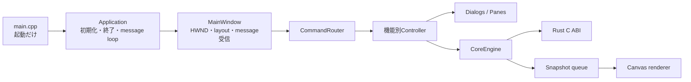

# inkpod

inkpod is a new, maintainable implementation of an animation-paint workflow.
The project has completed milestone M1: a platform-independent Rust Core owns a
sparse two-plane cell, stroke history, view state, and `.inkpod` persistence;
the versioned C ABI connects it to a Windows 11 Win32/Direct2D drawing slice.

The repository's implementation contract is [AGENTS.md](AGENTS.md), with
feature behavior and milestones defined by [PROMPT.md](PROMPT.md).

## Prerequisites

Building the complete Windows application requires:

- Windows 11
- Visual Studio 2022 or 2026 with the **Desktop development with C++** workload, the
  x64 MSVC toolchain, and a Windows SDK
- CMake 3.25 or newer
- Ninja
- Rust 1.85 or newer using the stable MSVC toolchain

Open an **x64 Native Tools Command Prompt** or **Developer PowerShell** for the
installed Visual Studio version, then verify that the required tools are available:

```powershell
cl
cmake --version
ninja --version
rustc --version
cargo --version
```

The Ninja presets use the compiler environment that is already active; the word
`x64` in a preset name cannot change an x86 Developer Prompt into an x64 one.
Inkpod rejects a 32-bit compiler during CMake configuration. If a build directory
was previously configured from an x86 prompt, start an x64 prompt and replace its
stale compiler cache before building:

```powershell
cmake --fresh --preset windows-x64-release
cmake --build --preset windows-x64-release
```

## Build and test the Windows application

CMake is the build entry point for the complete application. It invokes Cargo
to build the Rust `inkpod-ffi` static library and then links it into the MSVC
targets, so a separate `cargo build` step is not required.

From the repository root, configure, build, and test a Debug build:

```powershell
cmake --preset windows-x64-debug
cmake --build --preset windows-x64-debug
ctest --preset windows-x64-debug
```

Run the Debug application with:

```powershell
.\build\windows-x64-debug\inkpod.exe
```

For a Release build, use the corresponding Release preset:

```powershell
cmake --preset windows-x64-release
cmake --build --preset windows-x64-release
ctest --preset windows-x64-release
.\build\windows-x64-release\inkpod.exe
```

The application creates a 1920 x 1080 binary-color cell. Its menus expose
new/open/save/revert, Undo/Redo, zoom/pan/fit/1:1, pencil/brush/eraser,
main-line/color plane switching, and an RGBA8 drawing color. UI/input, the
single-writer Rust Core engine, and D3D/D2D rendering run on separate threads.
Live stroke previews are published before pointer-up and commit as one Undo
unit. The Windows smoke test verifies that path together with protected-main-line
drawing, history, view revision separation, save/discard/reopen, D2D tile cache,
device-pixel Fit bounds across DPI changes, and simulated device loss.

## Validate the Rust workspace only

The platform-independent Rust workspace can be validated anywhere a compatible
stable Rust toolchain is available:

```text
cargo fmt --all -- --check
cargo clippy --workspace --all-targets --all-features -- -D warnings
cargo test --workspace --all-features
```

On systems where enterprise Code Integrity policy blocks a locally built,
unsigned Rust FFI test executable, compile all tests and run the Core tests
separately:

```text
cargo test --workspace --all-features --no-run
cargo test --package inkpod-core --all-features
```

## Windows Shell


