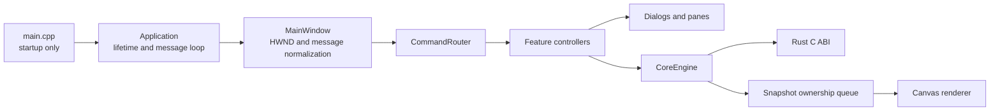

# Windows frontend refactoring plan

## 1. Purpose

This document is the execution plan for incrementally decomposing
`apps/windows/app/main.cpp` while preserving inkpod's behavior, public C ABI,
file formats, Windows UI semantics, and three-thread architecture.

The refactoring is not complete merely because code has moved into more files.
Completion requires clearer ownership, narrower dependencies, preserved tests,
and a small top-level entry point and window procedure.

The authority order for this work is:

1. The current user request
2. `AGENTS.md`
3. `PROMPT.md`
4. This document
5. Tested existing contracts

Before implementing any step, read this document completely together with the
relevant sections of `PROMPT.md` and `docs/implementation-status.md`.

## 2. Current baseline

At the time this plan was written:

- `apps/windows/app/main.cpp` has approximately 16,300 physical lines and is
  about 702 KB.
- `AppState` has roughly one hundred member declarations covering window
  handles, document shell state, tools, panes, animation, effects, batch, and
  smoke-test state.
- `MainWindowProcedure` is approximately 3,900 lines and contains about 304
  `case` labels, including about 273 menu command labels.
- `UpdateMenuState` is approximately 600 lines and also performs state
  transitions such as changing the active tool and clearing previews.
- M1-M7 Windows application smoke implementations occupy roughly 2,900 lines
  inside `main.cpp`.
- `CoreEngine` and the Canvas renderer are already separate modules. The
  UI/Input, Core engine, and Renderer thread boundaries and snapshot ownership
  are established and must remain intact.
- `inkpod.exe --smoke-test` and `inkpod.exe --abi-smoke-test` are CTest
  entry points. The installed MSIX smoke also invokes `--abi-smoke-test`.

This is structural debt rather than evidence of a current correctness failure.
Existing strict builds and integration tests are the regression baseline.

## 3. Goals

- Reduce `main.cpp` to startup argument handling and a call to the application
  runner, with a soft target of 100-200 lines.
- Reduce the top-level main-window procedure to Win32 message normalization and
  delegation, with a soft target of 200-300 lines.
- Replace the flat `AppState` with composed, responsibility-owned state.
- Route command IDs to cohesive feature controllers.
- Make command enabled/checked state computation free of unrelated mutations.
- Give dialogs typed input/output models instead of access to the entire
  application state or Core.
- Preserve the production UI path exercised by the Windows smoke tests.
- Improve incremental compilation and make feature changes reviewable in
  isolation.

Line targets are design indicators, not acceptance criteria by themselves.
A collection of thin files sharing one uncontrolled global state is not a
successful refactoring.

## 4. Non-goals

- No new user-facing feature or GUI redesign.
- No change to `include/inkpod/core_ffi.h`, ABI version, ownership contract, or
  Rust export semantics unless a separate user request explicitly authorizes it.
- No change to the `.inkpod` format, image codec behavior, or savepoint rules.
- No movement of document, image-processing, selection, history, or persistence
  decisions from Rust into C++.
- No renderer rewrite and no change to snapshot ownership.
- No attempt to resolve unrelated known gaps recorded in
  `docs/implementation-status.md`.
- No removal of `--smoke-test` or `--abi-smoke-test` while current CTest and
  MSIX verification depend on them.

## 5. Invariants

Every step must preserve the following:

- The UI/Input thread owns HWNDs, Common Controls, and message dispatch.
- The Core engine thread creates, uses, and destroys `InkpodCore`.
- The Renderer thread owns D3D11, DXGI, Direct2D resources, the swap chain, and
  `Present`.
- Snapshot ownership moves through the existing ownership queue. Rejected or
  replaced snapshots are released exactly once.
- Shutdown stops and joins Core work before destroying the Canvas and joining
  renderer work.
- Pointer samples and stroke begin/end/cancel events are not dropped.
- C++ controllers remain thin adapters to typed C ABI operations.
- Core remains the source of truth for document and editing state.
- Menu, toolbar, shortcut, and context-menu state share command IDs and one
  enable/checked-state contract.
- Existing user changes are preserved and unrelated formatting or refactoring is
  not mixed into a step.

## 6. Target architecture



The intended source layout is:

```text
apps/windows/app/
  main.cpp
  application.h
  application.cpp
  app_context.h
  core_engine.h
  core_engine.cpp
  document_shell.h
  document_shell.cpp
  clipboard_adapter.h
  clipboard_adapter.cpp
  app_smoke.h
  app_smoke.cpp

apps/windows/ui/
  main_window.h
  main_window.cpp
  main_window_runtime.h
  main_window_runtime.cpp
  command_router.h
  command_router.cpp
  command_state.h
  command_state.cpp
  dialogs/
    about_dialog.*
    basic_dialogs.*
    effects_dialogs.*
    batch_dialog.*
  panes/
    document_panes.*
    color_panes.*
  tools/
    view_controller.*
    selection_controller.*
    vector_controller.*
    fill_controller.*
  effects_controller.*
  batch_controller.*

apps/windows/renderer/
  canvas.h
  canvas.cpp
```

This is a target map, not a requirement to create all files immediately.
Directories and files are created only when they receive real responsibility.
Closely related code may remain together when splitting it further would only
add forwarding layers.

## 7. Dependency and ownership rules

### 7.1 Application layer

- `main.cpp` includes the application runner and contains no feature command
  handling.
- `Application` owns initialization order, startup Recovery choice, the
  message loop, and shutdown order.
- Application code may compose UI, CoreEngine, and renderer-facing objects but
  must not implement domain operations.

### 7.2 Main window and command routing

- The main window procedure handles or delegates only top-level `WM_*`
  messages.
- `WM_COMMAND` is routed by command ID to one feature owner.
- Each command ID has exactly one handler owner.
- Controllers return a small result describing handled/status/refresh effects;
  error presentation and common refresh work are coordinated centrally.
- A controller must not directly mutate another controller's private state.

A possible internal result type is:

```cpp
struct CommandResult {
    bool handled{};
    InkpodStatus status{INKPOD_STATUS_OK};
    RefreshFlags refresh{};
};
```

This is illustrative. Use a simpler type if it satisfies the same ownership and
refresh guarantees.

### 7.3 Dialogs

- Dialog procedures receive dialog-specific state through `lParam`.
- Public dialog entry functions accept typed initial values and return typed
  results.
- Dialog modules do not receive `AppContext&`, call `CoreEngine`, or invoke
  Rust FFI directly.
- Cancel leaves caller state unchanged.

### 7.4 State

The first transitional shape may be:

```cpp
struct AppContext {
    AppLifetimeState lifetime;
    MainWindowHandles windows;
    DocumentShellState document;
    ToolUiState tools;
    ViewUiState view;
    PaneUiState panes;
    AnimationUiState animation;
    EffectsUiState effects;
    BatchUiState batch;
    std::unique_ptr<CoreEngine> engine;
};
```

This is not permission to pass `AppContext&` to every extracted function.
After transitional grouping, controllers should receive only the state and
services they own.

### 7.5 Internal visibility

- Cross-translation-unit declarations stay in private headers under
  `apps/windows`; they do not enter the public `include/inkpod` API.
- Avoid generic `helpers.*`, `common.*`, or `utils.*` dumping grounds.
- Do not introduce a new all-knowing `ApplicationController` that merely
  replaces the old monolith.

## 8. Step status

Allowed status values in this table are `Not started`, `In progress`, and
`Complete`.

| Step | Status | Depends on | Result |
|---|---|---|---|
| R0 | Complete | — | Regression baseline and refactoring safety rules confirmed |
| R1 | Complete | R0 | Self-contained dialogs and runtime helpers extracted |
| R2 | Complete | R1 | Application state grouped with explicit ownership |
| R3 | Complete | R2 | Feature controllers, shell adapters, and panes extracted |
| R4 | Complete | R3 | Main window procedure reduced to message delegation |
| R5 | Complete | R4 | Shared, side-effect-free command state implemented |
| R6 | Complete | R5 | Bootstrap and smoke support separated; final boundaries verified |

Only mark a step `Complete` when all of its acceptance criteria and required
verification pass. If part of a step lands safely, mark it `In progress` and
record the remaining substeps.

## 9. Detailed execution steps

### R0: Establish the regression baseline

Tasks:

- Confirm `git status` and protect existing user changes.
- Re-read the current Windows architecture and implementation-status records.
- Run the applicable Rust and Windows validation commands from Section 10.
- Record any environment-specific blocker without changing expected behavior.
- Inventory production command IDs and their current handler ownership so later
  routing cannot silently omit or duplicate a command.
- Record baseline file/function sizes for comparison; do not turn raw line
  counts into hard correctness gates.

Acceptance criteria:

- Existing Debug application and ABI smoke tests pass.
- Release validation is recorded, or an exact external execution blocker is
  recorded.
- The current three-thread and snapshot-ownership behavior is confirmed.
- No production behavior has changed.

### R1: Extract self-contained dialogs and runtime helpers

Tasks:

- Move COM apartment lifetime support out of `main.cpp`.
- Extract About dialog code first, using it as the module pattern.
- Extract shortcut, view, text-input, fill, and history dialogs.
- Extract M6 editor/progress and Batch progress/palette dialogs.
- Give each dialog typed input/output state and preserve owner, DPI, resource,
  validation, OK, and Cancel behavior.
- Update CMake source lists explicitly.

Suggested substeps:

- R1.1: COM runtime and About dialog
- R1.2: Shortcut, view, text-input, fill, and history dialogs
- R1.3: Effects and Batch dialogs

Acceptance criteria:

- Dialog modules do not depend on the complete application state.
- Cancel behavior and validation remain unchanged.
- About DPI/layout/application smoke checks remain green.
- `main.cpp` no longer contains dialog procedures.

### R2: Group state and establish ownership

Tasks:

- Replace the flat `AppState` members with nested state types for lifetime,
  window handles, document shell, tools, view, panes, animation, effects, and
  Batch.
- Keep initial values identical.
- Split cross-feature reset functions into explicit owner resets.
- Narrow function arguments as ownership becomes clear.
- Keep Core document metadata cached only where the existing thread adapter
  requires it; do not create a C++ document model.

Suggested substeps:

- R2.1: Window, lifetime, and document-shell state
- R2.2: Tool, view, pane, and animation state
- R2.3: Effects and Batch state
- R2.4: Narrow high-traffic function signatures

Acceptance criteria:

- Top-level application state is composition rather than approximately one
  hundred unrelated fields.
- A feature reset cannot silently reset unrelated state.
- No document rule has moved from Rust to C++.
- All existing smoke scenarios pass.

### R3: Extract feature controllers and Windows shell adapters

Tasks:

- Extract document Open/Save/Recovery/autosave and common-raster shell flow.
- Extract Windows clipboard integration.
- Extract tree/plane, light-table, sequence, locator, palette, and chart panes.
- Extract view/guide/grid, fill, selection, vector, and floating-paste control.
- Extract M6 effects/adjustments and Batch graph/preview/run UI control.
- Keep FFI calls batched and on the Core engine thread through `CoreEngine`.
- Introduce a narrow command result/refresh contract where it removes duplicated
  error and refresh paths.

Suggested substeps:

- R3.1: Document shell, Recovery, import/export, and clipboard
- R3.2: Tree, light-table, sequence, locator, palette, and chart panes
- R3.3: View, fill, selection, vector, and floating-paste controllers
- R3.4: Effects and Batch controllers

Acceptance criteria:

- Every extracted feature has one identifiable owner.
- Controllers do not directly modify another controller's private state.
- Windows adapters own OS dialogs and clipboard; Rust still owns codecs and
  document conversion.
- CoreEngine and renderer thread contracts are unchanged.

### R4: Reduce the main window procedure

Tasks:

- Move main chrome creation and layout to `MainWindow`.
- Delegate `WM_COMMAND`, `WM_NOTIFY`, Canvas/Core notifications, timers,
  keyboard input, and close handling to named handlers.
- Route command groups to the controllers established in R3.
- Preserve value/pointer lifetime rules for synchronous and posted messages.
- Keep HWND mutation on the UI thread.

Acceptance criteria:

- The top-level window procedure is approximately 200-300 lines or otherwise
  demonstrably limited to message normalization and delegation.
- Feature workflows are not implemented inline in the window procedure.
- Every production command ID is owned exactly once.
- Pointer/stroke ordering, timer behavior, close cancellation, and destruction
  ordering pass existing smoke tests.

### R5: Separate command state from state transitions

Tasks:

- Replace the monolithic `UpdateMenuState` with feature-specific command-state
  providers.
- Move active-tool fallback and preview clearing into an explicit tool or
  active-plane transition handler.
- Compute enabled/checked state without unrelated mutations.
- Apply one shared command-state result to menus, toolbar controls, shortcuts,
  and context menus as applicable.
- Add focused Windows tests for important command-state combinations such as no
  document, dirty document, Undo/Redo, vector/non-vector active plane, active
  preview/task, and Batch readiness.

Acceptance criteria:

- Querying command state does not mutate Core, tool choice, previews, or
  document state.
- Menu, toolbar, shortcut, and context-menu state cannot drift for the same
  command ID.
- No command has missing or duplicate state ownership.
- Existing GUI smoke tests and new focused state tests pass.

### R6: Finalize bootstrap and smoke boundaries

Tasks:

- Move initialization, startup Recovery, default-cell creation, message loop,
  and shutdown into `Application`.
- Reduce `main.cpp` to launch-mode parsing and application invocation.
- Move M1-M7 smoke implementation out of `main.cpp`.
- Preserve `--smoke-test` and `--abi-smoke-test`, including the installed
  MSIX ABI-smoke path.
- Decide whether smoke code remains an embedded translation unit or is linked
  through a reusable private frontend library. Prefer the smallest design that
  still tests the real packaged executable.
- Remove transitional broad headers and obsolete forwarding functions.
- Update architecture and implementation-status documentation with measured,
  verified final boundaries.

Acceptance criteria:

- `main.cpp` contains no feature commands, dialogs, panes, or smoke scenario
  bodies.
- Application, MainWindow, controllers, dialogs, CoreEngine, and renderer have
  clear acyclic dependencies.
- Public ABI and file-format behavior remain unchanged.
- Debug and Release Windows verification pass.
- The installed-package ABI smoke is run when the environment permits; any
  elevation or policy blocker is recorded exactly.

## 10. Verification matrix

Use the real preset names from `CMakePresets.json`.

For each completed implementation substep:

```text
git diff --check
cmake --preset windows-x64-debug
cmake --build --preset windows-x64-debug
ctest --preset windows-x64-debug -E m8_windows_msix_install_uninstall_smoke --output-on-failure
```

At each full R-step boundary, also run:

```text
cargo fmt --all -- --check
cargo clippy --workspace --all-targets --all-features -- -D warnings
cargo test --workspace --all-features
cmake --preset windows-x64-release
cmake --build --preset windows-x64-release
ctest --preset windows-x64-release -E m8_windows_msix_install_uninstall_smoke --output-on-failure
```

Run the elevated `m8_windows_msix_install_uninstall_smoke` at R6, or earlier if
the packaged executable, embedded ABI-smoke route, package layout, or runtime
payload changes. Do not claim it passed when UAC, Application Control, or another
external policy prevented execution.

If a command is blocked by the known local Application Control behavior, use the
documented WSL/Windows fallback where applicable and record the exact command,
platform, and outcome. A blocked test leaves the affected step `In progress`
unless equivalent evidence fully satisfies its acceptance criterion.

## 11. Documentation updates during implementation

After each completed substep:

- Update the status table in Section 8.
- Add a concise entry to the progress log in Section 13.
- Update `docs/implementation-status.md` with verification evidence when the
  change materially affects the recorded post-M8 refactoring baseline.
- Update `docs/architecture.md` when ownership or dependency boundaries
  actually change.
- Do not change a requirement's compatibility status solely because source was
  moved. Update `docs/compatibility.md` only when its evidence or known
  difference changes.

## 12. Reusable implementation prompt

Copy the following prompt for each implementation run. Set `STEP_ID` to a
specific step or substep such as `R1.1`, `R3.2`, or `R5`. Use `NEXT` to
select the first incomplete substep whose dependencies are complete.

```text
inkpod の Windows frontend リファクタリングを実装してください。

対象ステップ: {{STEP_ID または NEXT}}
追加指示: {{必要なら記入。なければ「なし」}}

作業規則:

1. 最初に git status と既存差分を確認し、ユーザーの変更を保護してください。
2. AGENTS.md、PROMPT.md の関連節、docs/implementation-status.md、
   REFACTORING.md をすべて読み、REFACTORING.md を今回のリファクタリング
   手順の正本として扱ってください。
3. 対象が NEXT の場合、REFACTORING.md の依存関係を満たす最初の未完了
   substepを選び、選択理由を短く示してください。対象が明示されている場合は、
   そのstepの依存関係が完了していることを確認してください。
4. 計画だけで終了せず、対象stepまたは安全に完結するsubstepを実装し、
   acceptance criteriaまで検証してください。
5. 挙動保存を原則とし、新機能、GUI変更、ABI変更、file-format変更、
   Rustへの責務変更、renderer/thread/snapshot ownership変更を混ぜないでください。
6. main.cppを単に複数ファイルへコピーするだけにせず、REFACTORING.md の
   ownershipとdependency rulesを守ってください。helpers/common/utilsの
   物置moduleや新しい巨大controllerを作らないでください。
7. --smoke-test と --abi-smoke-test、およびMSIXからのABI smoke経路を
   維持してください。
8. CMakeのsource listを更新し、対象範囲に応じてREFACTORING.md Section 10の
   検証を実行してください。実行できなかった検証と理由を隠さないでください。
9. 完了した範囲だけREFACTORING.mdのstatusとprogress logを更新してください。
   acceptance criteriaまたは必要な検証が未完了ならCompleteにしないでください。
   必要に応じてdocs/architecture.mdとdocs/implementation-status.mdも更新してください。
10. commit、push、PR作成は行わないでください。

最終報告には以下を含めてください:

- 実装したstep/substep
- 利用者向け挙動が変わっていないこと
- 新しい責務境界と重要な設計判断
- 変更ファイル
- 実行した検証と結果
- 未実行の検証、残作業、既知差分
```

For an entire numbered step, replace the fourth rule with:

```text
4. 計画だけで終了せず、対象step内のsubstepを依存順にすべて実装し、
   step全体のacceptance criteriaまで検証してください。途中で安全に進められない
   実際のblockerが見つかった場合だけ停止し、具体的な証拠を示してください。
```

## 13. Progress log

Add newest entries first. Keep entries concise and evidence-based.

| Date | Step | Result | Verification | Remaining |
|---|---|---|---|---|
| 2026-07-26 | R6 | Complete: `main.cpp` is a 45-line launch-mode adapter; the 231-line `Application` owns initialization, Recovery/default-cell startup, message loop, and shutdown; unchanged M1-M7 smoke bodies are a dedicated private translation unit linked into the real executable; MainWindow retains production presentation/routing without a new broad controller | `git diff --check`; exact smoke-body comparison 2,886/2,886 lines with zero differences; Rust fmt/clippy/133 tests; strict Debug and Release builds; frontend-boundary and existing ownership tests; non-elevated CTest passed 8/8 in both presets, including application, ABI, and package-payload smoke | None for R6; MSIX install/uninstall smoke was omitted as explicitly permitted for this run, leaving the pre-existing M8 package acceptance gap unchanged |
| 2026-07-26 | R5 | Complete: all 273 production commands have one feature-specific state owner; pure providers compute one cached result consumed by menus, toolbar buttons, keyboard shortcuts, and the Batch palette; vector-tool fallback and preview clearing now occur only through explicit tool/active-plane transitions | `git diff --check`; state ownership 273/273 and focused no-document/dirty/Undo-Redo/vector/floating-preview/Batch-task tests; Rust fmt/clippy/133 tests; strict Debug and Release builds; non-elevated CTest passed 7/7 in both presets, including application, ABI, command-state surface parity, route/state ownership, and package-payload smoke | None for R5; MSIX install/uninstall smoke was omitted as explicitly permitted for this run |
| 2026-07-26 | R4 | Complete: standard main chrome creation/layout/class registration moved to a narrow `MainWindow` module; 273 production commands route through 11 feature owners, while lifecycle/notify, keyboard, Canvas, Core/task, and timer/close messages use five named handlers; the top-level procedure is 24 lines | `git diff --check`; command-route structural test 273/273 with no duplicate owners; Rust fmt/clippy/133 tests; strict Debug and Release builds; non-elevated CTest passed 5/5 in both presets, including application, ABI, route-ownership, and package-payload smoke | None for R4; MSIX install/uninstall smoke was omitted as explicitly permitted for this run |
| 2026-07-26 | R3 | Complete: R3.1-R3.4 implemented; document/clipboard shell adapters, pane model adapters, focused view/fill/selection/vector/floating-paste controllers, and effects/Batch task and graph owners were extracted with explicit CMake sources | `git diff --check`; Rust fmt/clippy/133 tests; strict Debug and Release builds; non-elevated CTest passed 4/4 in both presets, including application, ABI, and package-payload smoke | None for R3; MSIX install/uninstall smoke was omitted as explicitly permitted for this run |
| 2026-07-26 | R2 | Complete: R2.1-R2.4 implemented; the flat `AppState` became a private composed `AppContext`, document-replacement resets were split by state owner, and effects/Batch callbacks and derived-handle helpers now receive only their owned state | `git diff --check`; Rust fmt/clippy/133 tests; strict Debug and Release builds; non-elevated CTest passed 4/4 in both presets, including application and ABI smoke | None for R2; elevated MSIX install/uninstall smoke was omitted as explicitly permitted for this run |
| 2026-07-26 | R1 follow-up | About reuses the embedded application ICO through `LoadIconWithScaleDown`; the WIC loader, duplicate Win32 PNG resources, and `windowscodecs` link were removed while Shell STA ownership remains | Rust fmt/clippy/133 tests passed; strict Debug and Release builds passed; non-elevated CTest passed 4/4 in both presets | None for R1; elevated MSIX install smoke still requires an administrator shell |
| 2026-07-26 | R1 | Complete: R1.1-R1.3 implemented; COM lifetime and all modal/modeless dialog procedures moved behind typed, private Windows UI boundaries; explicit CMake sources added | Rust fmt/clippy/tests passed; strict Debug and Release builds passed; non-elevated Debug and Release CTest passed 4/4; elevated launch was cancelled at UAC and accepted by the user as a recorded external blocker | None |
| 2026-07-26 | R0 | Clean baseline captured, production command ownership inventoried, size metrics recorded, and three-thread/snapshot contracts reconfirmed without production changes | Baseline Rust validation and Debug/Release configure, build, and non-elevated CTest passed | None |
| 2026-07-25 | Plan | Refactoring plan created; no production source changed | Document review only | R0-R6 not started |
