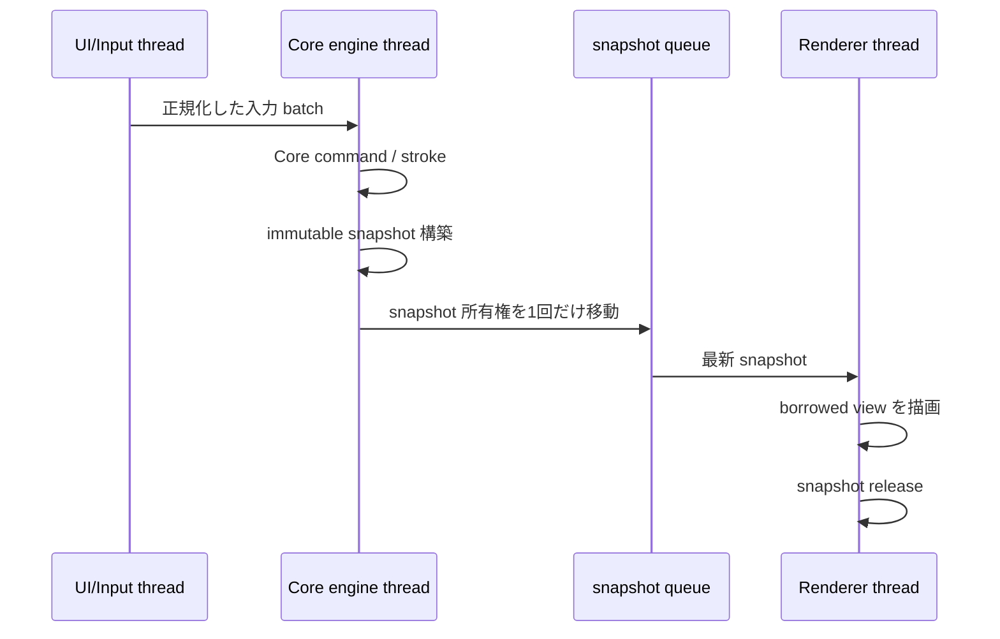

# FFI 利用ガイド

Inkpod の公開 C ABI は [`include/inkpod/core_ffi.h`](../include/inkpod/core_ffi.h) を仕様の正本とする。
各型・関数の引数、`struct_size`、NULL 可否、スレッド、所有権、出力、revision、dirty、Undo、
排他状態、戻りステータスはヘッダーの Doxygen コメントに記載している。この文書は関数一覧を
複製せず、frontend が ABI を安全に利用するための横断的な契約と典型的な呼び出し順序を説明する。

## 全体像

Windows frontend は UI/Input、Core engine、Renderer の三つの長寿命 thread に分かれる。

- UI/Input thread は Windows message と pointer history を受け取り、入力を bounded C++ queue へ渡す。
- Core engine thread は `InkpodCore` を作成し、すべての Core 操作と snapshot 構築を行う。
- Renderer thread は D3D11/DXGI/Direct2D resource と `Present` を所有し、immutable snapshot だけを読む。

Core は C++ callback を呼ばない。UI thread は Core や Renderer の完了を同期的に待たず、Renderer は
古い未描画 snapshot だけを置き換えてよい。stroke の begin/end/cancel と入力 sample 自体は捨てない。



## ABI と構造体

数値は固定幅 C 型を使う。Rust の `Vec`、`String`、slice、enum layout、trait object、reference と、
C++ の STL、reference、exception は ABI を越えない。文字列は UTF-8 pointer と byte count、配列は
pointer、count、byte stride で表す。

拡張可能な構造体を渡すときは、少なくとも次を守る。

```cpp
InkpodSnapshotOptions options{};
options.struct_size = sizeof(options);
options.feature_flags = INKPOD_FEATURE_NONE;
```

- `struct_size` は必ず呼び出し側が設定する。出力構造体でも同じである。
- ABI v1 で既知の構造体末尾まで読み書きできるサイズが必要である。
- `reserved` は 0、未知の必須 feature flag は指定しない。
- record span は各 record の `struct_size` と `*_stride_bytes` の両方を設定する。
- count、stride、alignment、全 span の byte 範囲が有効でなければならない。
- count が 0 の任意 span だけはデータ pointer を NULL にできる。各 API の例外はヘッダーを参照する。
- 入力、出力、opaque object の記憶域を重ねない。

ABI version は Core 作成前に比較できる。`INKPOD_ABI_VERSION` と library の戻り値が異なる場合は、
Core を作らず互換性エラーとして扱う。

## スレッド契約

`InkpodCore` は single-writer かつ thread-affine である。作成、文書操作、view 操作、stroke、履歴、
保存／open、snapshot 構築、destroy は、すべて Core を作成した Core engine thread から呼ぶ。
違反は `INKPOD_STATUS_WRONG_THREAD` となり、handle や出力の所有権は移動しない。

例外は immutable handle と atomic task である。

- snapshot の accessor と release は任意 thread で呼べる。同じ snapshot の参照と release は外部同期する。
- M6 task と batch task の query/cancel は、Core operation の実行中に別 thread から呼べる。
- task の release は任意 thread でよいが、その task を使う Core call が戻るまで待つ。
- immutable batch graph、preview、report、byte buffer、encoded sequence、clipboard の accessor/release は
  Core affinity を持たない。同じ handle の利用と release は呼び出し側で同期する。

任意 thread で呼べることは、同じ owner 変数を同時に解放してよいことを意味しない。

## 所有権と有効期間

### borrowed 入力

通常の `const T*` 入力、UTF-8 span、byte span、sample span は、その API 呼び出し中だけ borrowed
（借用）である。保持が必要な API は戻る前に意味値をコピーする。caller は API が戻った後に入力
buffer を再利用または解放できる。

### Rust-owned handle

opaque handle を生成する API は `T** out_*` を受け取る。owner 変数は呼び出し前に NULL でなければ
ならず、成功時だけ Rust-owned handle が入る。対応する release/destroy は pointer-to-owner を受け、
所有権を消費して同じ owner 変数を NULL にする。

```cpp
InkpodSnapshot* snapshot = nullptr;
InkpodStatus status = inkpod_core_build_snapshot(core, &options, &snapshot);
if (status == INKPOD_STATUS_OK) {
    // snapshot を所有している
}

inkpod_snapshot_release(&snapshot);
// snapshot == nullptr。同じ owner 変数での再 release は成功 no-op。
```

release 後は、handle から得た tile、pixel、guide、vector、文字列、byte span と、コピーしておいた
別名 pointer を一切使わない。Rust が確保した object を `free`、`delete`、`CoTaskMemFree` で解放しない。

主な owner と borrowed view の関係は次のとおりである。

| owner | 生成 | borrowed view の有効期間 | 解放 |
|---|---|---|---|
| Core | create 成功から destroy まで | Core pointer は owner thread の call 中だけ利用 | Core owner thread |
| snapshot | build 成功から release まで | tile/pixel/transform/guide/vector view は release まで | 外部同期した任意 thread |
| clipboard | copy/create 成功から release まで | raster export は caller buffer。内部 payload は公開しない | 外部同期した任意 thread |
| byte buffer | export 成功から release まで | byte span は release まで | 外部同期した任意 thread |
| encoded sequence | export 成功から release まで | item name/byte span は release まで | 外部同期した任意 thread |
| M6/batch task | create 成功から release まで | query 値は caller へのコピー | Core call 終了後に任意 thread |
| batch graph | create/load 成功から release まで | execute/preview 中は graph が生存する必要がある | 外部同期した任意 thread |
| batch preview/report | Core call の出力から release まで | item の UTF-8 span は親 handle の release まで | 外部同期した任意 thread |

snapshot の raster tile storage は snapshot 側で独立して参照計数されるため、snapshot は作成元 Core より
長く生存できる。ただし通常の shutdown では Renderer queue を drain して snapshot を先に解放すると、
所有権の追跡が簡潔になる。

## 出力と失敗

値出力は caller-owned である。成功時だけ利用し、失敗時はヘッダーが部分出力を保証する場合を除いて
読まない。特に owner 出力は呼び出し前に NULL にし、戻り値が失敗でも念のため NULL のままか確認する。

部分出力を意図的に返す代表的なパターンは次のとおりである。

- `INKPOD_STATUS_BUFFER_TOO_SMALL` は必要な count/byte 数を返す。
- `INKPOD_STATUS_FILL_OVERFLOW` は漏れ候補座標を返すが、文書を変更しない。
- cancelled batch execution は `INKPOD_STATUS_CANCELLED` と owned report を同時に返すことがある。
- error-message copy の失敗は written byte 数を 0 にし、同じ thread の diagnostic を保持する。

Rust panic は ABI 境界で捕捉され `INKPOD_STATUS_PANIC` になる。C++ exception も ABI を越えさせない。

## size query と caller-owned buffer

可変長出力は、まず NULL/容量 0 で必要量を問い合わせ、caller が確保した後に再度呼ぶ。API により
必要量の field 名は異なるため、各構造体の Doxygen 契約を確認する。

```cpp
InkpodClipboardRasterBuffer output{};
output.struct_size = sizeof(output);

InkpodStatus status = inkpod_clipboard_render_rgba8(clipboard, &output);
if (status != INKPOD_STATUS_BUFFER_TOO_SMALL && status != INKPOD_STATUS_OK) {
    // diagnostic を取得して中止
}

std::vector<std::uint8_t> pixels(static_cast<std::size_t>(output.required_bytes));
output.pixels_rgba8 = pixels.data();
output.pixel_capacity = pixels.size();
status = inkpod_clipboard_render_rgba8(clipboard, &output);
```

2 回の call の間に対象 object を変更または解放しない。Core 文書を対象とする query では、必要量取得と
本取得を同じ Core engine work item 内で行うと revision drift を避けられる。

## 編集状態と排他

Core が持つ transient editing state は、committed document と分離される。

| 状態 | 開始／更新中の committed revision・dirty・Undo | snapshot | 完了 |
|---|---|---|---|
| live stroke | begin/append では不変 | stroke preview を観測できる | end が実変更を高々 1 Undo 単位で commit。cancel は完全復元 |
| filter/dust preview | begin/update では不変 | transient preview revision を観測できる | apply が 1 Undo 単位で commit。cancel は original base を保持 |
| floating paste | begin/transform では不変 | floating preview を観測できる | commit が高々 1 Undo 単位。cancel は base を保持 |

1 Core に各 state は高々 1 個であり、live stroke と filter/dust preview は同時に存在できない。
競合する文書編集、履歴移動、保存、open、layer/plane 操作、別 preview 開始は
`INKPOD_STATUS_INVALID_STATE` になる。immutable snapshot 構築は transient state 中も許される。

live stroke の append が失敗した場合、部分的な preview を後から end で commit してはならない。
Core は session を無効化するため、frontend は stroke を打ち切り、必要なら cancel を行って次の begin へ進む。

## revision、dirty、Undo の読み方

`document_revision` は committed document の識別に使う。view-only 状態は `view_revision`、filter/stroke
preview の描画更新は snapshot 側の transient revision で区別する。

| 操作の種類 | document revision | dirty | Undo |
|---|---|---|---|
| query、snapshot accessor、task、shortcut、view-only 操作 | 不変 | 不変 | 不変 |
| stroke begin/append、preview begin/update、floating transform | 不変 | 不変 | 不変 |
| stroke end、preview apply、floating commit | 実変更時に 1 回進む | dirty | 高々 1 単位 |
| 直接の文書編集 | 実変更時に 1 回進む | dirty | 原則 1 単位 |
| Undo/Redo/history jump | 結果状態へ進む | savepoint との位置で再計算 | cursor を移動し item は増やさない |
| 通常保存 | 不変 | 現在位置を savepoint として clean | 不変 |
| autosave | 不変 | 不変 | 不変 |
| new/open/import/recovery | 新しい文書情報が正本 | 戻り情報が正本 | 旧 history を引き継がない |

no-op の厳密な出力や revision は各関数の Doxygen 契約に従う。frontend は file timestamp ではなく、
Core が返す document flags と savepoint に基づいて未保存状態を表示する。

## 典型的な起動から終了まで

### 1. Core を作る

Core engine thread を開始し、その thread 上で ABI version を確認して Core を作る。

```cpp
InkpodCoreConfig config{};
config.struct_size = sizeof(config);
config.abi_version = INKPOD_ABI_VERSION;
config.feature_flags = INKPOD_FEATURE_NONE;

InkpodCore* core = nullptr;
Check(inkpod_core_create(&config, &core));
```

`core` owner 変数は Core engine object が一意に保持する。raw Core pointer を UI message の
`WPARAM`/`LPARAM` に積まない。

### 2. new または open

新規作成では platform adapter が非 0 の 128-bit UUID、寸法、DPI を用意する。open では Windows file
dialog が得た path を UTF-8 byte span に変換し、Core engine thread へコピーして渡す。いずれも成功時の
`InkpodDocumentInfo` を UI state の初期値とする。

open/decode が失敗した場合、現在の文書は保持される。frontend は失敗前に tab や Renderer state を
破棄せず、成功通知を受けてから切り替える。

### 3. stroke を streaming する

UI/Input thread は pointer history を client device pixel 座標で正規化し、bounded queue へ batch で入れる。
Core engine thread は style と最初の sample で begin し、後続 sample を append する。sample ごとに FFI を
往復したり snapshot を作ったりしない。

```text
pointer down
  → stroke begin（style + initial samples）
  → stroke append（0回以上の sample batch）
  → stroke end
pointer cancel / capture lost
  → stroke cancel
```

描画中の見た目が必要なら、frame cadence に合わせて begin/append 後に snapshot を作る。end は pointer up
と同じ順序で必ず Core queue に入り、成功した stroke 全体を 1 Undo 単位にする。

### 4. snapshot の所有権を Renderer へ移す

Core engine thread は owner 変数を NULL から構築し、snapshot sink へ raw owner をちょうど 1 回渡す。
sink は enqueue 成否にかかわらず release 責任を引き受ける。

```cpp
InkpodSnapshot* next = nullptr;
Check(inkpod_core_build_snapshot(core, &options, &next));

snapshot_sink.Submit(next); // この呼び出しで所有権を移動する
next = nullptr;             // Core engine 側は以後参照・release しない
```

`Submit` が queue full で snapshot を採用しない場合も、sink 内で直ちに release する。呼び出し元へ所有権を
戻す設計と混在させない。snapshot pointer を `PostMessage` の値引数として送らず、所有権を明示した C++ queue
を使う。

### 5. Renderer が読み、release する

Renderer thread は snapshot から raster view、transform、overlay、vector view を取得し、親 snapshot の
生存中だけ借用する。古い pending snapshot を最新のものへ置き換える場合、置換された owner をその場で
release する。描画完了、device reset、window shutdown の各経路でも owner を一度だけ release する。

### 6. shutdown する

推奨順序は次のとおりである。

```text
UI/Input の新規投入を停止
  → active stroke/preview/floating を end/apply または cancel
  → Core work queue を drain
  → snapshot sink を閉じる
  → Renderer の pending/current snapshot をすべて release
  → task/report/preview/graph/clipboard/byte buffer を release
  → Core engine thread 上で core destroy
  → Core engine / Renderer thread を join
```

`inkpod_core_destroy` は live transient state を commit せず破棄し、owner 変数を NULL にする。snapshot は Core
より長く生存できるが、通常 shutdown では先に Renderer owner を解放して leak 検出を単純にする。

## task、進捗、cancel

長時間処理では、task handle を先に作り、その handle を Core operation が戻るまで所有する。UI thread は
query で進捗を読み、ユーザー操作で cancel を要求できる。

```text
Core engine: task create → Core operation(task) ─────────→ return → task release
UI thread:                         query / query / cancel
```

cancel は要求であり、即時終了の保証ではない。Core が cancellation を poll すると staged result を破棄し、
`INKPOD_STATUS_CANCELLED` を返す。file 出力を伴う処理は完成済み temporary file だけを置換対象とし、cancel や
failure で部分出力を commit しない。

batch execution だけは cancel/失敗時にも report owner を返し得る。戻り status を確認した後も
`out_report != NULL` なら内容を読み、必ず release する。

## 保存、autosave、recovery

通常保存は同一 directory の temporary file を完成・flush・close してから置換する。成功時だけ normal path と
savepoint が進み、dirty が解消する。失敗時に元 file を truncate しない。

autosave は recovery file を atomic に書くが、normal path/savepoint と dirty を変えない。recovery open は
文書を dirty・recovered・pathless として開く。以前の通常 file を上書きするには、ユーザーが明示した path で
改めて通常保存する必要がある。

active stroke/preview/floating 中は保存や open を実行せず、Core queue 上で完了または cancel 後に行う。

## diagnostic の取得

error text は thread-local UTF-8 である。失敗した API と同じ thread で、まず trailing NUL を含む必要 byte 数を
取得し、次に caller buffer へコピーする。別 thread へ status と text を通知する場合は、Core engine thread で
text を `std::string` へコピーしてから queue へ渡す。

```cpp
std::string CopyInkpodError() {
    std::uint64_t required = 0;
    if (inkpod_error_message_size(&required) != INKPOD_STATUS_OK || required == 0) {
        return {};
    }

    std::string text(static_cast<std::size_t>(required), '\0');
    std::uint64_t written = 0;
    if (inkpod_error_message_copy(
            reinterpret_cast<std::uint8_t*>(text.data()), required, &written)
        != INKPOD_STATUS_OK) {
        return {};
    }
    text.resize(static_cast<std::size_t>(written));
    return text;
}
```

診断文にはユーザー path や画像内容を無制限に記録せず、UI 表示や log 側でも同じ方針を守る。

## 実装時の確認項目

- Core の create/全操作/destroy が同じ Core engine thread に固定されている。
- すべての構造体で `struct_size`、reserved、feature flags、record stride を初期化している。
- owned 出力変数を NULL で開始し、所有権移動後に元変数を NULL にしている。
- release 後に borrowed span や copied alias を使っていない。
- stroke/preview/floating の state machine と失敗時 cancel 経路がある。
- snapshot sink が enqueue 成否の両方で release 責任を一意に持つ。
- task を Core call 終了前に release していない。
- 戻り status が失敗でも返り得る batch report を解放している。
- dirty を file timestamp から推測せず、Core の document flags を使っている。
- C11 と C++20 の両方でヘッダーを include し、Rust 宣言との drift test を通している。
